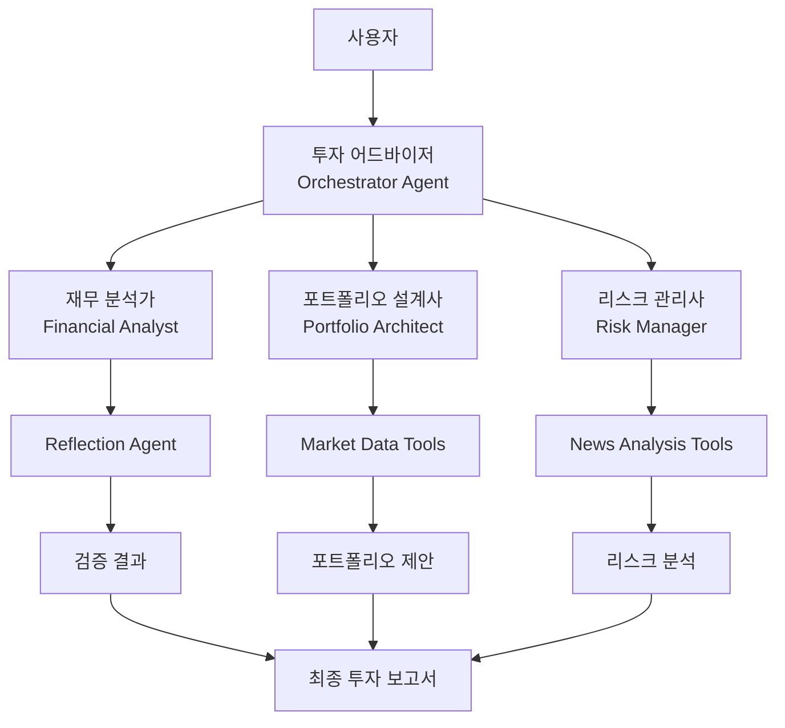

# 🤖 AI 투자 어드바이저 (Strands Agent)

AWS Bedrock 기반 시스템을 **Strands Agent**로 마이그레이션한 차세대 AI 투자 상담 서비스입니다.

## 🎯 프로젝트 개요

이 프로젝트는 **Agentic AI의 4가지 핵심 패턴**을 활용하여 개인 맞춤형 투자 포트폴리오를 제안하는 시스템입니다:

- **Reflection Pattern**: 재무 분석 결과의 자체 검증
- **Tool Use Pattern**: 실시간 시장 데이터 활용
- **Planning Pattern**: 시나리오 기반 리스크 관리  
- **Multi-Agent Pattern**: 전문가 에이전트들의 협업

## 🏗️ 시스템 아키텍처



## 📋 Lab 구성

### Lab 1: 재무 분석가 (Reflection Pattern)
- **목적**: 사용자 재무 상황 분석 및 자체 검증
- **패턴**: Reflection - AI가 자신의 분석 결과를 검증
- **구현**: `FinancialAnalyst` + `ReflectionAgent` (Swarm 패턴)

### Lab 2: 포트폴리오 설계사 (Tool Use Pattern)  
- **목적**: 실시간 시장 데이터 기반 포트폴리오 설계
- **패턴**: Tool Use - 외부 API 및 데이터 소스 활용
- **구현**: `PortfolioArchitect` + yfinance 도구

### Lab 3: 리스크 관리사 (Planning Pattern)
- **목적**: 뉴스 분석 기반 리스크 시나리오 계획
- **패턴**: Planning - 체계적인 워크플로우 기반 분석
- **구현**: `RiskManager` + Workflow 도구

### Lab 4: 투자 어드바이저 (Multi-Agent Pattern)
- **목적**: 전체 시스템 통합 및 최종 보고서 생성
- **패턴**: Multi-Agent - 여러 전문가 에이전트 협업
- **구현**: `InvestmentAdvisor` (Graph 패턴 예정)

## 🚀 설치 및 실행

### 1. 환경 설정

```bash
# 저장소 클론
git clone <repository-url>
cd investment_advisor_strands

# 가상환경 생성 및 활성화
python -m venv venv
source venv/bin/activate  # Windows: venv\Scripts\activate

# 패키지 설치
pip install -r requirements.txt
```

### 2. API 키 설정

```bash
# .env 파일 생성
cp .env.example .env

# .env 파일 편집하여 API 키 입력
ANTHROPIC_API_KEY=your_anthropic_api_key_here
```

### 3. 개별 Lab 테스트

```bash
# 전체 Lab 순차 테스트
python test_agents.py

# 개별 Lab 테스트
python -m agents.lab1_financial_analyst
python -m agents.lab2_portfolio_architect  
python -m agents.lab3_risk_manager
python -m agents.lab4_investment_advisor
```

### 4. Streamlit 앱 실행

```bash
streamlit run streamlit_app.py
```

브라우저에서 `http://localhost:8501`로 접속하여 웹 인터페이스를 사용할 수 있습니다.

## 📊 사용 방법

### 웹 인터페이스 (Streamlit)
1. 사이드바에서 투자 정보 입력:
   - 총 투자 가능 금액
   - 나이
   - 주식 투자 경험 연수
   - 1년 후 목표 금액

2. "🚀 투자 분석 시작" 버튼 클릭

3. 결과 확인:
   - **최종 보고서**: 종합 투자 가이드
   - **재무 분석**: Reflection 패턴 결과
   - **포트폴리오**: Tool Use 패턴 결과
   - **리스크 분석**: Planning 패턴 결과
   - **상세 데이터**: 전체 분석 데이터

### 프로그래밍 인터페이스

```python
from agents import InvestmentAdvisor

# 투자 어드바이저 초기화
advisor = InvestmentAdvisor()

# 사용자 입력
user_input = {
    "total_investable_amount": 50000000,
    "age": 35,
    "stock_investment_experience_years": 10,
    "target_amount": 70000000
}

# 투자 분석 실행
result = advisor.process_investment_request(user_input)

# 결과 확인
if result['status'] == 'success':
    print(result['final_report'])
else:
    print(f"Error: {result['message']}")
```

## 🔧 기술 스택

- **AI Framework**: Strands Agents SDK
- **LLM**: Anthropic Claude 3.5 Sonnet/Haiku
- **Data Source**: yfinance (Yahoo Finance API)
- **Web Framework**: Streamlit
- **Visualization**: Plotly
- **Data Processing**: Pandas, NumPy

## 📈 주요 기능

### 🤖 Agentic AI 패턴
- **Reflection**: 분석 결과 자체 검증으로 정확성 향상
- **Tool Use**: 실시간 시장 데이터 및 뉴스 분석
- **Planning**: 체계적인 리스크 시나리오 워크플로우
- **Multi-Agent**: 전문가 에이전트들의 협업 시스템

### 💰 투자 분석 기능
- 개인 맞춤형 위험 성향 평가
- 목표 수익률 기반 포트폴리오 설계
- 20개 주요 ETF 중 최적 조합 선택
- 실시간 가격 데이터 기반 배분 최적화
- 뉴스 기반 리스크 시나리오 분석
- 시나리오별 포트폴리오 조정 가이드

### 📊 시각화 및 보고서
- 인터랙티브 포트폴리오 차트
- 시나리오별 배분 비교
- 전문가 수준의 투자 보고서
- 상세한 분석 근거 제공

## 🔄 기존 AWS Bedrock Flow 대비 개선사항

| 구분 | 기존 (AWS Bedrock Flow) | 개선 (Strands Agent) |
|------|------------------------|---------------------|
| **아키텍처** | 정적 워크플로우 | 동적 에이전트 협업 |
| **실행 방식** | 순차 실행 | 조건부 분기 및 병렬 처리 |
| **확장성** | 제한적 | 에이전트 추가/수정 용이 |
| **관찰성** | 기본적 로깅 | 상세한 실행 추적 |
| **비용 효율성** | 항상 실행 | 필요시에만 실행 |
| **멀티모달** | 제한적 | 텍스트, 이미지 등 지원 |

## 🚧 향후 개발 계획

### Phase 1: 고급 패턴 구현 (예정)
- [ ] Graph 패턴으로 Multi-Agent 시스템 개선
- [ ] Workflow 도구 활용한 Planning 패턴 강화
- [ ] 조건부 실행 로직 구현

### Phase 2: 기능 확장 (예정)
- [ ] 실시간 포트폴리오 모니터링 에이전트
- [ ] 소셜 미디어 감정 분석 에이전트
- [ ] 백테스팅 및 성과 분석 에이전트
- [ ] 다국어 지원

### Phase 3: 배포 및 운영 (예정)
- [ ] AWS Bedrock AgentCore 배포
- [ ] 프로덕션 환경 구성
- [ ] 모니터링 및 알림 시스템
- [ ] 사용자 인증 및 세션 관리

## 🤝 기여하기

1. Fork the repository
2. Create your feature branch (`git checkout -b feature/AmazingFeature`)
3. Commit your changes (`git commit -m 'Add some AmazingFeature'`)
4. Push to the branch (`git push origin feature/AmazingFeature`)
5. Open a Pull Request

## 📄 라이선스

이 프로젝트는 MIT 라이선스 하에 배포됩니다. 자세한 내용은 `LICENSE` 파일을 참조하세요.

## 📞 문의

프로젝트에 대한 문의사항이나 제안사항이 있으시면 이슈를 생성해주세요.

---

**🎯 Strands Agent로 구현한 차세대 AI 투자 어드바이저를 경험해보세요!**