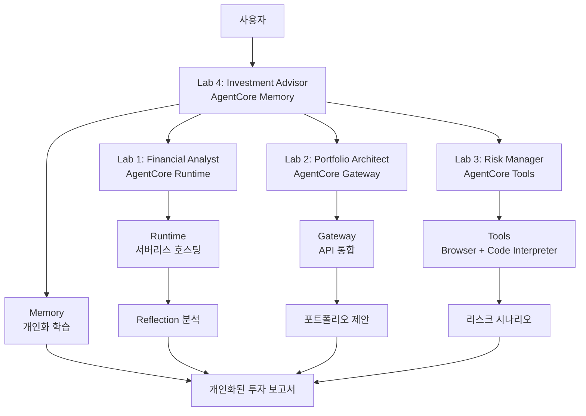

# 🤖 AI 투자 어드바이저 (AWS Bedrock AgentCore)

**AWS Bedrock AgentCore**의 4대 핵심 서비스를 활용한 차세대 AI 투자 상담 시스템입니다.

## 🎯 프로젝트 개요

이 프로젝트는 **Agentic AI의 4가지 핵심 패턴**과 **AWS Bedrock AgentCore 서비스**를 완벽하게 매핑하여 개인 맞춤형 투자 포트폴리오를 제안하는 엔터프라이즈급 시스템입니다:

- **Reflection Pattern** + **AgentCore Runtime**: 재무 분석 결과의 자체 검증 및 서버리스 배포
- **Tool Use Pattern** + **AgentCore Gateway**: 다양한 금융 API의 통합 MCP 인터페이스
- **Planning Pattern** + **AgentCore Tools**: 웹 크롤링과 고급 분석을 통한 리스크 시나리오 계획
- **Multi-Agent Pattern** + **AgentCore Memory**: 개인화된 장기 메모리 기반 에이전트 협업

## 🏗️ AgentCore 서비스 아키텍처



### 🎯 AgentCore 서비스별 역할

| Lab | AgentCore 서비스 | 핵심 기능 | 시연 포인트 |
|-----|-----------------|----------|------------|
| **Lab 1** | **Runtime** | 서버리스 에이전트 배포 | Reflection Pattern + 프로덕션 배포 |
| **Lab 2** | **Gateway** | 다양한 API 통합 | 실시간 금융 데이터 MCP 도구화 |
| **Lab 3** | **Tools** | 고급 분석 도구 | 웹 크롤링 + 복잡한 계산 |
| **Lab 4** | **Memory** | 개인화 및 학습 | 장기 메모리 기반 맞춤 서비스 |

## 📋 Lab 구성 (AgentCore 서비스 매핑)

### Lab 1: 재무 분석가 (Reflection Pattern + AgentCore Runtime)
- **AgentCore 서비스**: **Runtime** - 서버리스 에이전트 호스팅
- **패턴**: Reflection - AI가 자신의 분석 결과를 검증
- **구현**: `FinancialAnalyst` + `ReflectionAgent` → AgentCore Runtime 배포
- **핵심 기능**: 프로덕션 준비된 서버리스 재무 분석 서비스

### Lab 2: 포트폴리오 설계사 (Tool Use Pattern + AgentCore Gateway + Identity)  
- **AgentCore 서비스**: **Gateway + Identity** - API 통합 및 보안 인증
- **패턴**: Tool Use - 외부 API 및 데이터 소스 활용
- **구현**: `PortfolioArchitect` + 보안 금융 API 통합 (Bloomberg, Alpha Vantage, FRED 등)
- **핵심 기능**: 엔터프라이즈급 보안을 갖춘 실시간 시장 데이터 기반 포트폴리오 설계

### Lab 3: 리스크 관리사 (Planning Pattern + AgentCore Tools)
- **AgentCore 서비스**: **Tools** - Browser Tool + Code Interpreter
- **패턴**: Planning - 체계적인 워크플로우 기반 분석
- **구현**: `RiskManager` + 웹 크롤링 + 고급 리스크 계산
- **핵심 기능**: 실시간 뉴스 분석과 복잡한 수학적 리스크 모델링

### Lab 4: 투자 어드바이저 (Multi-Agent Pattern + AgentCore Memory)
- **AgentCore 서비스**: **Memory** - 장기 메모리 및 개인화
- **패턴**: Multi-Agent - 여러 전문가 에이전트 협업
- **구현**: `InvestmentAdvisor` + 사용자별 학습 메모리
- **핵심 기능**: 개인화된 투자 전략 및 장기 관계 구축

## 🚀 설치 및 실행

### 1. 환경 설정

```bash
# 저장소 클론
git clone <repository-url>
cd investment_advisor_strands

# 가상환경 생성 및 활성화
python -m venv venv
source venv/bin/activate  # Windows: venv\Scripts\activate

# 패키지 설치
pip install -r requirements.txt
```

### 2. API 키 설정

```bash
# .env 파일 생성
cp .env.example .env

# .env 파일 편집하여 API 키 입력
ANTHROPIC_API_KEY=your_anthropic_api_key_here
```

### 3. 개별 Lab 테스트

```bash
# 전체 Lab 순차 테스트
python test_agents.py

# 개별 Lab 테스트
python -m agents.lab1_financial_analyst
python -m agents.lab2_portfolio_architect  
python -m agents.lab3_risk_manager
python -m agents.lab4_investment_advisor
```

### 4. Streamlit 앱 실행

```bash
streamlit run streamlit_app.py
```

브라우저에서 `http://localhost:8501`로 접속하여 웹 인터페이스를 사용할 수 있습니다.

## 📊 사용 방법

### 웹 인터페이스 (Streamlit)
1. 사이드바에서 투자 정보 입력:
   - 총 투자 가능 금액
   - 나이
   - 주식 투자 경험 연수
   - 1년 후 목표 금액

2. "🚀 투자 분석 시작" 버튼 클릭

3. 결과 확인:
   - **최종 보고서**: 종합 투자 가이드
   - **재무 분석**: Reflection 패턴 결과
   - **포트폴리오**: Tool Use 패턴 결과
   - **리스크 분석**: Planning 패턴 결과
   - **상세 데이터**: 전체 분석 데이터

### 프로그래밍 인터페이스

```python
from agents import InvestmentAdvisor

# 투자 어드바이저 초기화
advisor = InvestmentAdvisor()

# 사용자 입력
user_input = {
    "total_investable_amount": 50000000,
    "age": 35,
    "stock_investment_experience_years": 10,
    "target_amount": 70000000
}

# 투자 분석 실행
result = advisor.process_investment_request(user_input)

# 결과 확인
if result['status'] == 'success':
    print(result['final_report'])
else:
    print(f"Error: {result['message']}")
```

## 🔧 기술 스택

### 🏗️ AWS Bedrock AgentCore 서비스
- **AgentCore Runtime**: 서버리스 에이전트 호스팅 및 배포
- **AgentCore Gateway**: API 통합 및 MCP 도구 변환
- **AgentCore Tools**: Browser Tool (웹 크롤링) + Code Interpreter (고급 계산)
- **AgentCore Memory**: 장기 메모리 및 개인화 학습
- **AgentCore Identity**: 보안 인증 및 권한 관리 (선택적)
- **AgentCore Observability**: 모니터링 및 성능 추적 (선택적)

### 🤖 AI 및 개발 프레임워크
- **AI Framework**: Strands Agents SDK
- **LLM**: Anthropic Claude 3.5 Sonnet/Haiku, Amazon Nova Pro
- **Data Sources**: Yahoo Finance, Bloomberg API, FRED Economic Data
- **Web Framework**: Streamlit
- **Visualization**: Plotly, Matplotlib
- **Data Processing**: Pandas, NumPy, SciPy

## 📈 주요 기능

### 🤖 Agentic AI 패턴 + AgentCore 서비스
- **Reflection + Runtime**: 분석 결과 자체 검증 + 서버리스 배포로 정확성과 확장성 확보
- **Tool Use + Gateway**: 다양한 금융 API 통합으로 실시간 시장 데이터 활용
- **Planning + Tools**: 웹 크롤링과 고급 계산을 통한 체계적 리스크 시나리오 워크플로우
- **Multi-Agent + Memory**: 개인화 학습 기반 전문가 에이전트 협업 시스템

### 💰 엔터프라이즈급 투자 분석 기능
- **개인화 분석**: AgentCore Memory 기반 사용자별 맞춤 위험 성향 평가
- **실시간 포트폴리오**: AgentCore Gateway를 통한 다양한 금융 데이터 소스 활용
- **고급 리스크 모델링**: AgentCore Tools의 Code Interpreter로 VaR, 몬테카르로 시뮬레이션
- **실시간 뉴스 분석**: AgentCore Tools의 Browser Tool로 Bloomberg, Reuters 등 크롤링
- **시나리오 기반 전략**: Planning Pattern으로 체계적인 리스크 대응 가이드
- **장기 관계 구축**: AgentCore Memory로 투자 성과 추적 및 전략 개선

### 📊 프로덕션 준비 기능
- **서버리스 배포**: AgentCore Runtime으로 자동 스케일링
- **보안 인증**: AgentCore Identity로 엔터프라이즈급 보안
- **성능 모니터링**: AgentCore Observability로 실시간 추적
- **인터랙티브 시각화**: 포트폴리오 차트, 리스크 히트맵, 시나리오 비교
- **전문가급 보고서**: 상세한 분석 근거와 개인화된 투자 가이드

## 🔄 AWS Bedrock AgentCore의 혁신적 개선사항

| 구분 | 기존 (단일 서비스) | 개선 (AgentCore 통합) |
|------|------------------|---------------------|
| **아키텍처** | 정적 워크플로우 | 동적 에이전트 협업 + 서비스 통합 |
| **배포 방식** | 수동 인프라 관리 | Runtime 서버리스 자동 배포 |
| **API 통합** | 개별 구현 필요 | Gateway MCP 자동 변환 |
| **고급 분석** | 제한적 계산 능력 | Tools 웹 크롤링 + 코드 실행 |
| **개인화** | 세션 기반 임시 | Memory 장기 학습 및 개인화 |
| **보안** | 기본 인증 | Identity 엔터프라이즈급 보안 |
| **관찰성** | 기본적 로깅 | Observability 상세 추적 |
| **확장성** | 수동 스케일링 | 자동 스케일링 + 서비스 조합 |

## 🚧 향후 개발 계획

### Phase 1: 고급 패턴 구현 (예정)
- [ ] Graph 패턴으로 Multi-Agent 시스템 개선
- [ ] Workflow 도구 활용한 Planning 패턴 강화
- [ ] 조건부 실행 로직 구현

### Phase 2: 기능 확장 (예정)
- [ ] 실시간 포트폴리오 모니터링 에이전트
- [ ] 소셜 미디어 감정 분석 에이전트
- [ ] 백테스팅 및 성과 분석 에이전트
- [ ] 다국어 지원

### Phase 3: 배포 및 운영 (예정)
- [ ] AWS Bedrock AgentCore 배포
- [ ] 프로덕션 환경 구성
- [ ] 모니터링 및 알림 시스템
- [ ] 사용자 인증 및 세션 관리

## 🤝 기여하기

1. Fork the repository
2. Create your feature branch (`git checkout -b feature/AmazingFeature`)
3. Commit your changes (`git commit -m 'Add some AmazingFeature'`)
4. Push to the branch (`git push origin feature/AmazingFeature`)
5. Open a Pull Request

## 📄 라이선스

이 프로젝트는 MIT 라이선스 하에 배포됩니다. 자세한 내용은 `LICENSE` 파일을 참조하세요.

## 📞 문의

프로젝트에 대한 문의사항이나 제안사항이 있으시면 이슈를 생성해주세요.

---

**🎯 Strands Agent로 구현한 차세대 AI 투자 어드바이저를 경험해보세요!**