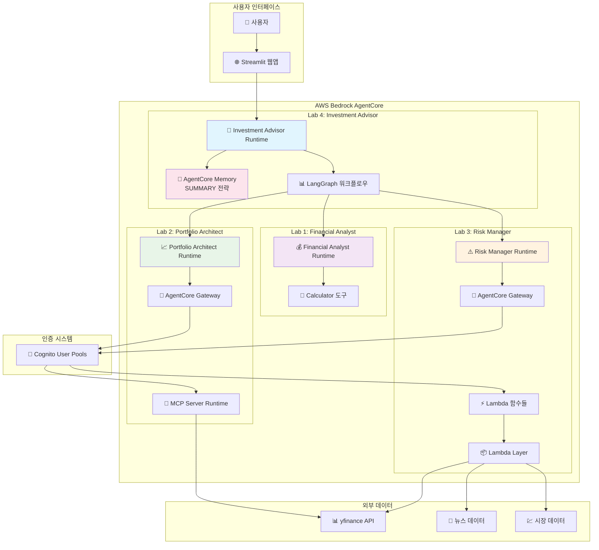
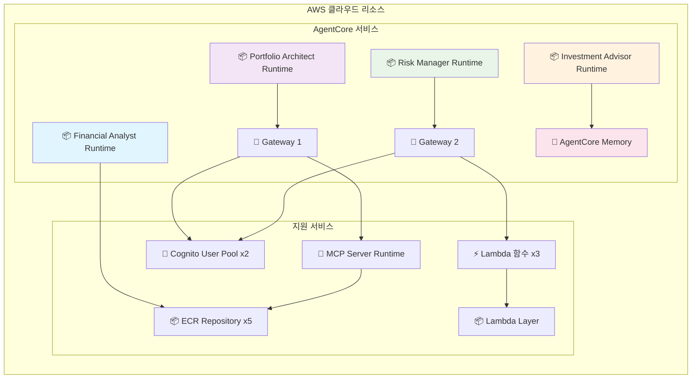

# 🤖 AI 투자 어드바이저

**AWS Bedrock AgentCore**를 활용한 Multi-Agent 투자 자문 시스템

## 🎯 시스템 개요

개인 맞춤형 투자 포트폴리오를 제안하는 4개의 전문 AI 에이전트가 협업하는 엔터프라이즈급 투자 자문 시스템입니다.

## 🏗️ 전체 시스템 아키텍처


```mermaid
graph TB
    subgraph "사용자 인터페이스"
        USER[👤 사용자]
        WEB[🌐 Streamlit 웹앱]
    end
    
    subgraph "AWS Bedrock AgentCore"
        subgraph "Lab 4: Investment Advisor"
            IA[🤖 Investment Advisor Runtime]
            MEMORY[🧠 AgentCore Memory<br/>SUMMARY 전략]
            LANGGRAPH[📊 LangGraph 워크플로우]
        end
        
        subgraph "Lab 1: Financial Analyst"
            FA[💰 Financial Analyst Runtime]
            CALC[🧮 Calculator 도구]
        end
        
        subgraph "Lab 2: Portfolio Architect"
            PA[📈 Portfolio Architect Runtime]
            GATEWAY1[🌉 AgentCore Gateway]
            MCP_SERVER[🔧 MCP Server Runtime]
        end
        
        subgraph "Lab 3: Risk Manager"
            RM[⚠️ Risk Manager Runtime]
            GATEWAY2[🌉 AgentCore Gateway]
            LAMBDA[⚡ Lambda 함수들]
            LAYER[📦 Lambda Layer]
        end
    end
    
    subgraph "외부 데이터"
        YFINANCE[📊 yfinance API]
        NEWS[📰 뉴스 데이터]
        MARKET[💹 시장 데이터]
    end
    
    subgraph "인증 시스템"
        COGNITO[🔐 Cognito User Pools]
    end
    
    USER --> WEB
    WEB --> IA
    IA --> LANGGRAPH
    LANGGRAPH --> FA
    LANGGRAPH --> PA
    LANGGRAPH --> RM
    
    FA --> CALC
    PA --> GATEWAY1
    GATEWAY1 --> COGNITO
    COGNITO --> MCP_SERVER
    MCP_SERVER --> YFINANCE
    
    RM --> GATEWAY2
    GATEWAY2 --> COGNITO
    COGNITO --> LAMBDA
    LAMBDA --> LAYER
    LAYER --> YFINANCE
    LAYER --> NEWS
    LAYER --> MARKET
    
    IA --> MEMORY
    
    style IA fill:#e1f5fe
    style FA fill:#f3e5f5
    style PA fill:#e8f5e8
    style RM fill:#fff3e0
    style MEMORY fill:#fce4ec
```

### 📋 전체 워크플로우

```
사용자 입력 → Financial Analyst → Portfolio Architect → Risk Manager → Investment Advisor → 최종 보고서
```

1. **사용자가 투자 정보 입력** (나이, 투자금액, 목표금액, 경험 등)
2. **Financial Analyst**가 재무 상황 분석 및 위험 성향 평가
3. **Portfolio Architect**가 실시간 ETF 데이터로 포트폴리오 설계
4. **Risk Manager**가 뉴스/시장 데이터로 리스크 시나리오 분석
5. **Investment Advisor**가 모든 결과를 통합하여 최종 투자 가이드 생성

## 🏗️ 에이전트별 상세 구조

### Lab 1: Financial Analyst
**역할**: 개인 재무 상황 분석 및 위험 성향 평가

**구조**:
- **AgentCore Runtime**: 서버리스 에이전트 호스팅
- **도구**: Calculator (정확한 수익률 계산)
- **AI 모델**: Claude 3.7 Sonnet

**처리 과정**:
1. 사용자 입력 데이터 분석 (나이, 투자경험, 투자금액, 목표금액)
2. Calculator 도구로 필요 연간 수익률 계산: `((목표금액/투자금액)-1)*100`
3. 나이와 경험을 고려한 위험 성향 평가 (보수적/중립적/공격적)
4. 개인 성향에 맞는 투자 섹터 추천

**출력**:
```json
{
  "risk_profile": "공격적",
  "required_annual_return_rate": 40.0,
  "key_sectors": ["성장주", "기술주", "글로벌 주식"],
  "summary": "40% 목표 수익률 달성을 위한 공격적 투자 전략 필요"
}
```

### Lab 2: Portfolio Architect
**역할**: 실시간 ETF 데이터 기반 최적 포트폴리오 설계

**구조**:
- **AgentCore Gateway**: 외부 API를 MCP 도구로 변환
- **MCP Server**: yfinance API 연동 (별도 Runtime으로 배포)
- **도구**: `analyze_etf_performance`, `calculate_correlation`
- **인증**: Cognito JWT OAuth2

**처리 과정**:
1. Financial Analyst 결과를 바탕으로 5개 후보 ETF 선정
2. 각 ETF에 대해 몬테카를로 시뮬레이션 (1000회) 실행
3. ETF 간 상관관계 매트릭스 계산 (분산투자 효과 측정)
4. 수익률과 분산투자 효과를 고려하여 최적 3개 ETF 선정
5. 투자 비중 결정 및 포트폴리오 평가 (수익성/리스크관리/분산투자 점수)

**출력**:
```json
{
  "portfolio_allocation": {"QQQ": 50, "SPY": 30, "GLD": 20},
  "reason": "기술주 중심 성장 전략...",
  "portfolio_scores": {
    "profitability": {"score": 8, "reason": "목표 수익률 달성 가능성 높음"},
    "risk_management": {"score": 7, "reason": "적정 변동성 수준"},
    "diversification": {"score": 9, "reason": "낮은 상관관계로 우수한 분산투자"}
  }
}
```

### Lab 3: Risk Manager
**역할**: 뉴스 및 거시경제 데이터 기반 리스크 시나리오 분석

**구조**:
- **AgentCore Gateway**: Lambda 함수를 MCP 도구로 노출
- **Lambda Layer**: yfinance 라이브러리 패키징
- **Lambda 함수**: 뉴스/시장/지정학적 데이터 조회
- **도구**: `get_product_news`, `get_market_data`, `get_geopolitical_indicators`

**처리 과정**:
1. 포트폴리오 ETF별 최신 뉴스 5개 수집 및 분석
2. 주요 거시경제 지표 7개 실시간 조회 (금리, 달러지수, VIX, 원유, 금, S&P500)
3. 지역별 ETF 5개 조회 (중국, 신흥국, 유럽, 일본, 한국)
4. 3가지 데이터를 종합하여 2개 핵심 경제 시나리오 도출
5. 각 시나리오별 포트폴리오 조정 전략 수립

**출력**:
```json
{
  "scenario1": {
    "name": "테크 주도 경기 회복",
    "probability": "35%",
    "allocation_management": {"QQQ": 70, "SPY": 25, "GLD": 5},
    "reason": "기술 섹터 성장에 더 많이 노출하여 수익 극대화"
  },
  "scenario2": {
    "name": "인플레이션 지속과 경기 둔화", 
    "probability": "25%",
    "allocation_management": {"QQQ": 40, "SPY": 40, "GLD": 20},
    "reason": "안전자산 비중 확대로 리스크 헤지 강화"
  }
}
```

### Lab 4: Investment Advisor
**역할**: 3개 에이전트 결과 통합 및 장기 메모리 관리

**구조**:
- **LangGraph**: 3개 에이전트 순차 실행 워크플로우
- **AgentCore Memory**: SUMMARY 전략으로 상담 히스토리 자동 요약
- **에이전트 호출**: 다른 3개 에이전트의 Runtime을 직접 호출

**처리 과정**:
1. **LangGraph 워크플로우 시작**: 사용자 입력으로 상태 초기화
2. **순차 에이전트 실행**:
   - `financial_node` → Financial Analyst Runtime 호출
   - `portfolio_node` → Portfolio Architect Runtime 호출  
   - `risk_node` → Risk Manager Runtime 호출
3. **실시간 스트리밍**: 각 에이전트의 사고 과정과 도구 사용을 실시간 표시
4. **메모리 저장**: 각 에이전트 결과를 세션별 대화 이벤트로 저장
5. **자동 요약**: SUMMARY 전략이 전체 상담 세션을 자동 요약하여 장기 보존

**메모리 구조**:
- **Short-term**: 각 에이전트 결과를 세션별 대화로 저장 (7일)
- **Long-term**: SUMMARY 전략이 전체 세션을 자동 요약 (영구 보존)
- **네임스페이스**: `investment/session/{sessionId}` 구조

## � 기술 적 구현 세부사항

### AgentCore 서비스 활용

**1. Runtime (서버리스 에이전트 호스팅)**
- 각 에이전트를 독립적인 서버리스 함수로 배포
- 자동 스케일링 및 고가용성 보장
- ECR 컨테이너 이미지 기반 배포

**2. Gateway (API 통합 및 MCP 변환)**
- 외부 API (yfinance)를 AI가 사용할 수 있는 MCP 도구로 변환
- Cognito JWT 인증으로 보안 강화
- Lambda 함수를 MCP 도구로 노출

**3. Tools (고급 분석 도구)**
- Lambda Layer로 복잡한 라이브러리 (yfinance) 패키징
- 웹 크롤링 및 실시간 데이터 조회 기능
- 복잡한 수학적 계산 (몬테카를로 시뮬레이션) 수행

**4. Memory (장기 메모리 및 개인화)**
- SUMMARY 전략으로 상담 세션 자동 요약
- 사용자별 투자 히스토리 장기 보존
- 개인화된 투자 서비스 제공 기반

### 데이터 흐름

```
사용자 입력
    ↓
Financial Analyst (Runtime)
    ↓ (위험성향, 목표수익률)
Portfolio Architect (Gateway + MCP Server)
    ↓ (포트폴리오 배분)
Risk Manager (Gateway + Lambda)
    ↓ (리스크 시나리오)
Investment Advisor (Memory + LangGraph)
    ↓
최종 투자 가이드 + 자동 요약 저장
```

## 🚀 빠른 시작

### 1. 환경 설정
```bash
git clone <repository-url>
cd investment_advisor_strands
python -m venv venv
source venv/bin/activate
pip install -r requirements.txt
aws configure
```

### 2. 전체 배포 (권장)
```bash
python deploy_all.py
```

### 3. 웹 앱 실행
```bash
cd investment_advisor && streamlit run app.py
```
브라우저에서 `http://localhost:8501` 접속

### 4. 전체 정리
```bash
python cleanup_all.py
```

## 🎯 사용 시나리오

### 시나리오 1: 전체 시스템 체험 (권장)
1. `python deploy_all.py` - 전체 시스템 배포
2. `cd investment_advisor && streamlit run app.py` - 통합 웹앱 실행
3. 투자 정보 입력 후 4개 에이전트의 협업 과정 실시간 확인
4. 상담 히스토리에서 자동 요약된 과거 상담 기록 확인

### 시나리오 2: 개별 에이전트 학습
1. `cd financial_analyst && python deploy.py && streamlit run app.py`
2. 재무 분석 과정과 Calculator 도구 사용 확인
3. `cd ../portfolio_architect` - 포트폴리오 설계 과정 학습
4. `cd ../risk_manager` - 리스크 분석 과정 학습

### 시나리오 3: 개발 및 커스터마이징
1. 각 에이전트 폴더의 `README.md` 참조
2. 개별 배포 및 테스트로 기능 확인
3. 코드 수정 후 개별 재배포
4. `investment_advisor/test_investment_advisor.py`로 통합 테스트

## 📊 실제 사용 예시

### 입력 예시
```
투자 가능 금액: 5천만원 (0.5억)
1년 후 목표 금액: 7천만원 (0.7억)  
나이: 35세
투자 경험: 10년
투자 목적: 단기 수익 추구
관심 분야: 성장주, 기술주
```

### 처리 과정 (실시간 스트리밍으로 확인 가능)

**1단계: Financial Analyst**
- Calculator 도구 실행: `((70000000/50000000)-1)*100 = 40%`
- 위험 성향 평가: "35세, 10년 경험 → 공격적"
- 추천 섹터: ["성장주", "기술주", "글로벌 주식"]

**2단계: Portfolio Architect**  
- 5개 후보 ETF 선정: QQQ, SPY, VTI, ARKK, GLD
- 각 ETF 몬테카를로 시뮬레이션 (1000회)
- 상관관계 분석 후 최적 3개 선정: QQQ(50%), SPY(30%), GLD(20%)

**3단계: Risk Manager**
- QQQ, SPY, GLD 뉴스 분석
- 거시경제 지표 확인 (금리, VIX, 달러지수 등)
- 2개 시나리오 도출: "테크 회복(35%)" vs "경기 둔화(25%)"

**4단계: Investment Advisor**
- 3개 결과 통합하여 최종 투자 가이드 생성
- AgentCore Memory에 전체 상담 세션 자동 요약 저장

### 최종 결과
- **포트폴리오**: QQQ 50%, SPY 30%, GLD 20%
- **예상 수익률**: 연 25-45% (시나리오별)
- **리스크 대응**: 경기 둔화 시 GLD 비중 확대 권장
- **상담 기록**: 자동으로 요약되어 장기 보존

## 🔧 기술 스택 및 아키텍처

### 핵심 기술
- **AI Framework**: Strands Agents SDK + LangGraph
- **Infrastructure**: AWS Bedrock AgentCore (Runtime, Gateway, Tools, Memory)
- **LLM**: Claude 3.7 Sonnet
- **Data Sources**: yfinance (실시간 ETF/뉴스/시장 데이터)
- **Authentication**: Cognito JWT OAuth2
- **UI**: Streamlit (실시간 스트리밍 지원)

### 배포 구조 다이어그램


```mermaid
graph LR
    subgraph "AWS 클라우드 리소스"
        subgraph "AgentCore 서비스"
            RT1[📦 Financial Analyst Runtime]
            RT2[📦 Portfolio Architect Runtime]
            RT3[📦 Risk Manager Runtime]
            RT4[📦 Investment Advisor Runtime]
            MEM[🧠 AgentCore Memory]
            GW1[🌉 Gateway 1]
            GW2[🌉 Gateway 2]
        end
        
        subgraph "지원 서비스"
            MCP[🔧 MCP Server Runtime]
            LAM[⚡ Lambda 함수 x3]
            LAY[📦 Lambda Layer]
            COG[🔐 Cognito User Pool x2]
            ECR[📦 ECR Repository x5]
        end
    end
    
    RT1 --> ECR
    RT2 --> GW1
    RT3 --> GW2
    RT4 --> MEM
    GW1 --> COG
    GW2 --> COG
    GW1 --> MCP
    GW2 --> LAM
    LAM --> LAY
    MCP --> ECR
    
    style RT1 fill:#e1f5fe
    style RT2 fill:#f3e5f5
    style RT3 fill:#e8f5e8
    style RT4 fill:#fff3e0
    style MEM fill:#fce4ec
```

**총 배포 리소스**: 
- 🏗️ **AgentCore**: Runtime 4개 + Gateway 2개 + Memory 1개
- ⚡ **Lambda**: 함수 3개 + Layer 1개 + MCP Server 1개
- 🔐 **인증**: Cognito User Pool 2개
- 📦 **컨테이너**: ECR Repository 5개

### 보안 및 인증
- **Cognito JWT**: MCP Gateway 접근 제어
- **IAM 역할**: 각 서비스별 최소 권한 원칙
- **VPC**: 필요시 네트워크 격리 (선택사항)
- **암호화**: 전송 중/저장 중 데이터 암호화

## 📁 프로젝트 구조 및 개별 테스트

```
investment_advisor_strands/
├── 📂 financial_analyst/           # Lab 1: 재무 분석 (AgentCore Runtime)
│   ├── 📄 README.md               # 상세 설명 및 사용법
│   ├── 🚀 deploy.py               # 개별 배포
│   ├── 🌐 app.py                  # Streamlit 개별 테스트
│   └── 🤖 financial_analyst.py    # 메인 에이전트
│
├── 📂 portfolio_architect/         # Lab 2: 포트폴리오 설계 (AgentCore Gateway)
│   ├── 📄 README.md               # 상세 설명 및 사용법
│   ├── 🚀 deploy.py               # 개별 배포
│   ├── 🌐 app.py                  # Streamlit 개별 테스트
│   ├── 🤖 portfolio_architect.py  # 메인 에이전트
│   └── 📂 mcp_server/             # MCP Server (별도 Runtime)
│       ├── 🚀 deploy_mcp.py       # MCP Server 배포
│       └── 🔧 server.py           # ETF 데이터 조회 서버
│
├── 📂 risk_manager/               # Lab 3: 리스크 관리 (AgentCore Tools)
│   ├── 📄 README.md               # 상세 설명 및 사용법
│   ├── 🚀 deploy.py               # 개별 배포 (4단계 통합)
│   ├── 🌐 app.py                  # Streamlit 개별 테스트
│   ├── 🤖 risk_manager.py         # 메인 에이전트
│   ├── 📂 lambda_layer/           # Lambda Layer (yfinance)
│   ├── 📂 lambda/                 # Lambda 함수 (데이터 조회)
│   └── 📂 gateway/                # MCP Gateway (Lambda → MCP 도구)
│
├── 📂 investment_advisor/         # Lab 4: 통합 자문 (AgentCore Memory)
│   ├── 📄 README.md               # 상세 설명 및 사용법
│   ├── 🚀 deploy.py               # 개별 배포
│   ├── 🌐 app.py                  # Streamlit 통합 웹앱 (메인)
│   ├── 🤖 investment_advisor.py   # LangGraph 기반 통합 에이전트
│   ├── 🧪 test_investment_advisor.py # 시스템 테스트
│   └── 📂 agentcore_memory/       # AgentCore Memory
│       └── 🚀 deploy_agentcore_memory.py # Memory 배포
│
├── 📂 shared/                     # 공통 유틸리티
│   ├── runtime_utils.py           # Runtime 관련 공통 함수
│   ├── gateway_utils.py           # Gateway 관련 공통 함수
│   └── cognito_utils.py           # 인증 관련 공통 함수
│
├── 🚀 deploy_all.py               # 🎯 전체 시스템 한번에 배포
├── 🧹 cleanup_all.py              # 🎯 전체 시스템 한번에 정리
├── 📋 requirements.txt            # Python 의존성
└── 📄 README.md                   # 이 파일
```

### 🧪 개별 에이전트 테스트 방법

각 에이전트는 독립적으로 배포하고 테스트할 수 있습니다:

#### Lab 1: Financial Analyst
```bash
cd financial_analyst
python deploy.py                    # 배포
streamlit run app.py               # 개별 테스트 웹앱
```
- **기능**: 투자자 정보 입력 → 위험 성향 평가 → 목표 수익률 계산
- **도구**: Calculator로 정확한 수익률 계산 과정 확인

#### Lab 2: Portfolio Architect  
```bash
cd portfolio_architect
cd mcp_server && python deploy_mcp.py && cd ..  # MCP Server 먼저 배포
python deploy.py                    # 메인 에이전트 배포
streamlit run app.py               # 개별 테스트 웹앱
```
- **기능**: 재무 분석 결과 입력 → ETF 분석 → 포트폴리오 설계
- **도구**: 몬테카를로 시뮬레이션 + 상관관계 분석 과정 실시간 확인

#### Lab 3: Risk Manager
```bash
cd risk_manager
# 4단계 순차 배포 (또는 python deploy.py로 통합 실행)
cd lambda_layer && python deploy_lambda_layer.py && cd ..
cd lambda && python deploy_lambda.py && cd ..
cd gateway && python deploy_gateway.py && cd ..
python deploy.py                    # 메인 에이전트 배포
streamlit run app.py               # 개별 테스트 웹앱
```
- **기능**: 포트폴리오 입력 → 뉴스/시장 데이터 분석 → 리스크 시나리오
- **도구**: 실시간 뉴스, 거시경제 지표, 지정학적 데이터 수집 과정 확인

#### Lab 4: Investment Advisor (통합 시스템)
```bash
cd investment_advisor
cd agentcore_memory && python deploy_agentcore_memory.py && cd ..  # Memory 먼저 배포
python deploy.py                    # 통합 에이전트 배포
streamlit run app.py               # 🎯 메인 통합 웹앱
python test_investment_advisor.py  # 시스템 전체 테스트
```
- **기능**: 전체 워크플로우 실행 → 3개 에이전트 순차 호출 → 최종 투자 가이드
- **특징**: 실시간 스트리밍으로 모든 에이전트의 사고 과정 확인 + 상담 히스토리 관리

---

**🎯 AWS Bedrock AgentCore로 구현한 차세대 AI 투자 어드바이저!** 🚀