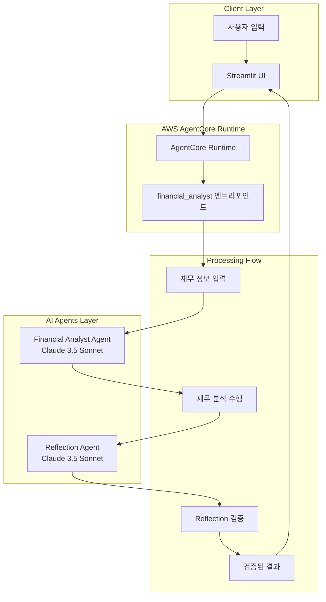
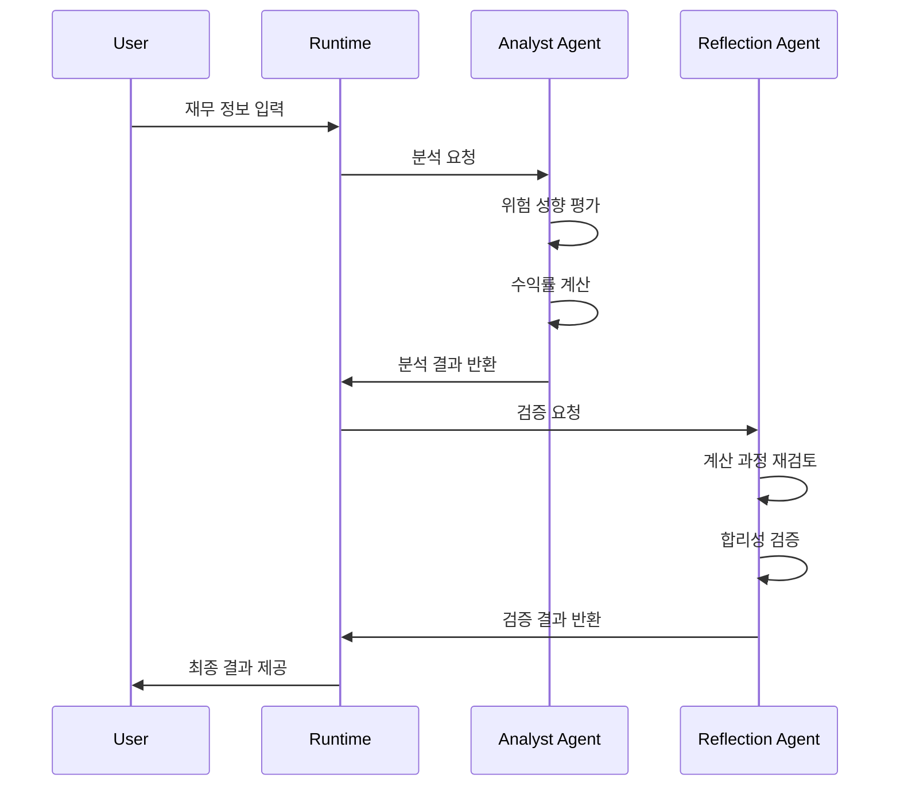

# Financial Analyst

개인의 재무 상황을 분석하여 투자 성향과 목표 수익률을 계산하는 AI 에이전트입니다. **Reflection 패턴**을 활용하여 분석 결과의 정확성과 신뢰성을 보장하며, **AWS Bedrock AgentCore Runtime** 기반으로 서버리스 환경에서 실행됩니다.

## 🎯 핵심 기능

### 재무 상황 종합 분석
- **다차원 분석**: 나이, 연간 소득, 투자 경험, 현재 자산을 종합적으로 고려
- **생애주기 고려**: 연령대별 투자 기간과 위험 감수 능력 평가
- **경험 기반 평가**: 투자 경험 년수를 통한 시장 이해도 측정

### 위험 성향 평가 (5단계)
- **매우 보수적**: 안정성 최우선, 원금 보장 선호
- **보수적**: 낮은 변동성, 안정적 수익 추구
- **중립적**: 적정 수준의 위험과 수익 균형
- **공격적**: 높은 수익을 위한 위험 감수
- **매우 공격적**: 최대 수익 추구, 높은 변동성 수용

### 목표 수익률 계산
- **복리 계산**: 목표 기간과 목표 금액을 고려한 정확한 수익률 산출
- **달성 가능성 분석**: 시장 상황과 개인 역량을 고려한 현실성 평가
- **단계별 설명**: 계산 과정을 투명하게 공개

### Reflection 품질 검증
- **이중 검증**: 별도 AI 에이전트가 분석 결과 재검토
- **오류 감지**: 계산 실수나 논리적 모순 자동 탐지
- **신뢰성 보장**: 0%~50% 수익률 범위 내 합리성 검증

## 🏗️ 아키텍처

### 시스템 아키텍처 다이어그램



### Agentic AI 패턴: Reflection Pattern



### Strands Agent 구성
- **Financial Analyst Agent**: 
  - 역할: 재무 상황 분석 및 위험 성향 평가
  - 모델: Claude 3.5 Sonnet (설정 가능)
  - 온도: 0.1 (일관성 있는 분석을 위한 낮은 창의성)
  
- **Reflection Agent**:
  - 역할: 분석 결과 검증 및 품질 보장
  - 모델: Claude 3.5 Sonnet (별도 설정 가능)
  - 온도: 0.1 (정확한 검증을 위한 낮은 창의성)

### AgentCore 구성요소

#### Runtime
- **실행 환경**: AWS Lambda 기반 서버리스
- **확장성**: 자동 스케일링으로 동시 요청 처리
- **비용 효율성**: 사용한 만큼만 과금

#### 보안 및 권한
- **IAM 역할**: Bedrock 모델 접근 권한
- **VPC**: 필요시 프라이빗 네트워크 구성
- **암호화**: 전송 중/저장 중 데이터 암호화

## 🚀 배포 및 실행

### 사전 요구사항
- AWS CLI 설정 및 인증
- Docker 설치 (이미지 빌드용)
- Python 3.9+ 환경
- Bedrock 모델 접근 권한

### 1. 환경 설정
```bash
# AWS 자격 증명 확인
aws sts get-caller-identity

# 필요한 권한 확인
aws bedrock list-foundation-models --region us-west-2
```

### 2. 배포 실행
```bash
# 배포 스크립트 실행 (15분 소요)
python deploy.py

# 배포 상태 확인
cat deployment_info.json
```

### 3. Streamlit 앱 실행
```bash
# 의존성 설치
pip install streamlit boto3

# 앱 실행
streamlit run app.py
```

### 4. 배포 확인
- 브라우저에서 `http://localhost:8501` 접속
- 테스트 데이터로 분석 실행
- 결과 및 Reflection 검증 확인

## 📊 상세 입력/출력 명세

### 입력 데이터 구조
```json
{
  "total_investable_amount": 50000000,    // 총 투자 가능 금액 (원)
  "age": 35,                             // 나이
  "stock_investment_experience_years": 10, // 주식 투자 경험 (년)
  "target_amount": 70000000              // 1년 후 목표 금액 (원)
}
```

### 출력 데이터 구조
```json
{
  "risk_profile": "중립적",
  "risk_profile_reason": "35세의 중년층으로 10년의 투자 경험을 보유하고 있어 시장에 대한 이해도가 높습니다. 현재 자산 대비 목표 금액이 적정 수준이므로 중립적 위험 성향이 적합합니다.",
  "required_annual_return_rate": 40.0,
  "return_rate_reason": "현재 5천만원에서 1년 후 7천만원 달성을 위해서는 (70,000,000 / 50,000,000 - 1) × 100 = 40%의 연간 수익률이 필요합니다. 이는 상당히 높은 수준으로 공격적인 투자 전략이 요구됩니다."
}
```

### Reflection 검증 결과
- **성공 시**: `"yes"` (추가 설명 없음)
- **실패 시**: `"no\n실패 사유 설명"`

## 🔧 고급 설정

### 모델 설정 커스터마이징
```python
# financial_analyst.py에서 수정 가능

class Config:
    # 재무 분석사 모델 설정
    ANALYST_MODEL_ID = "us.anthropic.claude-3-7-sonnet-20250219-v1:0"
    ANALYST_TEMPERATURE = 0.1      # 0.0-1.0 (낮을수록 일관성 높음)
    ANALYST_MAX_TOKENS = 2000      # 응답 최대 길이
    
    # Reflection 검증 모델 설정 (다른 모델 사용 가능)
    REFLECTION_MODEL_ID = "us.anthropic.claude-3-7-sonnet-20250219-v1:0"
    REFLECTION_TEMPERATURE = 0.1   # 검증의 정확성을 위해 낮게 설정
    REFLECTION_MAX_TOKENS = 2000
```

### 프롬프트 엔지니어링
- **분석 프롬프트**: `_get_analyst_prompt()` 함수에서 수정
- **검증 프롬프트**: `_get_reflection_prompt()` 함수에서 수정
- **출력 형식**: JSON 스키마 엄격 준수

### 성능 최적화
- **모델 선택**: 용도에 따른 최적 모델 선택
- **토큰 수 조정**: 응답 길이와 비용 균형
- **온도 설정**: 일관성과 창의성 균형

## 🔍 모니터링 및 디버깅

### 로그 확인
```bash
# CloudWatch 로그 확인
aws logs describe-log-groups --log-group-name-prefix "/aws/lambda/financial-analyst"

# 실시간 로그 스트리밍
aws logs tail /aws/lambda/financial-analyst-runtime --follow
```

### 성능 메트릭
- **응답 시간**: 평균 5-10초 (Reflection 포함)
- **성공률**: 99%+ (정상 입력 기준)
- **Reflection 검증률**: 95%+ (분석 품질 보장)
- **비용**: 요청당 약 $0.01-0.05 (Analyst + Reflection)

### 문제 해결
- **배포 실패**: IAM 권한 및 Docker 설치 확인
- **모델 접근 오류**: Bedrock 권한 및 리전 확인
- **응답 오류**: 입력 데이터 형식 및 범위 확인

## 📁 프로젝트 구조

```
financial_analyst/
├── financial_analyst.py    # 메인 에이전트 클래스
├── deploy.py              # AgentCore Runtime 배포 스크립트
├── app.py                 # Streamlit 웹 애플리케이션
├── requirements.txt       # Python 의존성
├── __init__.py           # 패키지 초기화
├── .bedrock_agentcore.yaml # AgentCore 설정
├── Dockerfile            # 컨테이너 이미지 정의
└── deployment_info.json  # 배포 정보 (자동 생성)
```