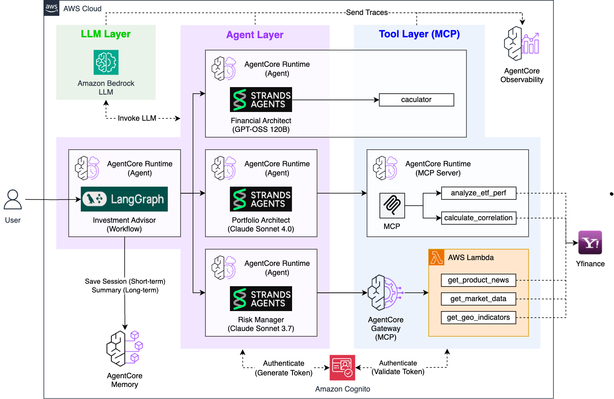
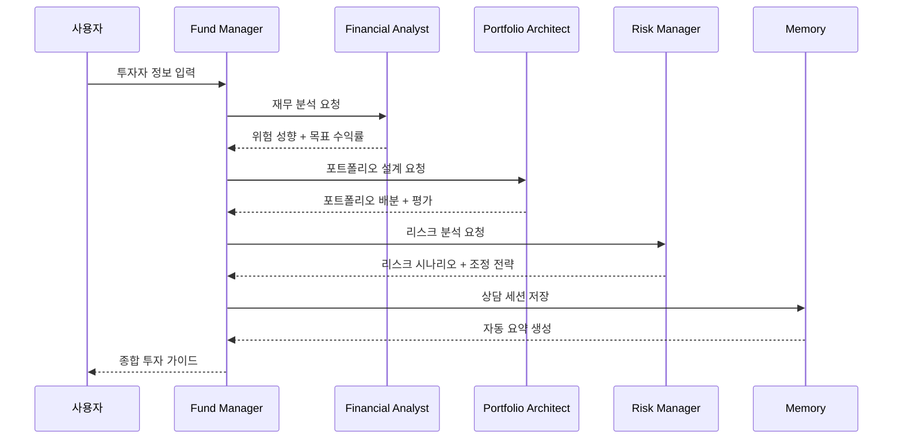

# Fund Manager

**LangGraph + AgentCore Memory**를 활용한 AI 펀드 매니저입니다.

## 🎯 개요

3개의 전문 AI 에이전트(Financial Analyst, Portfolio Architect, Risk Manager)를 LangGraph 워크플로우로 통합하여 종합적인 투자 분석을 제공하고, AgentCore Memory를 통해 상담 히스토리를 자동으로 관리하는 AI 에이전트입니다.

### 핵심 기능
- **LangGraph 워크플로우**: 3개 에이전트의 순차적 협업 시스템
- **실시간 스트리밍**: 각 에이전트의 사고 과정과 도구 사용을 실시간 시각화
- **AgentCore Memory**: SUMMARY 전략으로 상담 히스토리 자동 요약 및 영구 보존
- **완전 자동화**: 사용자 입력만으로 전체 펀드 매니징 프로세스 완료

## 🏗️ 아키텍처



### LangGraph 워크플로우 구조
```python
# fund_manager.py의 핵심 구조
workflow = StateGraph(FundManagerState)

# 3개 노드 정의
workflow.add_node("financial", financial_node)      # 재무 분석
workflow.add_node("portfolio", portfolio_node)      # 포트폴리오 설계
workflow.add_node("risk", risk_node)               # 리스크 분석

# 순차 실행 흐름
workflow.set_entry_point("financial")
workflow.add_edge("financial", "portfolio")
workflow.add_edge("portfolio", "risk")
workflow.add_edge("risk", END)
```

### 기술 스택
- **AI Framework**: LangGraph + Strands Agents SDK
- **Infrastructure**: AWS Bedrock AgentCore Runtime + Memory
- **LLM**: 다른 에이전트 호출 (자체 모델 없음)
- **Data Sources**: yfinance (실시간 ETF/뉴스/시장 데이터)
- **UI**: Streamlit

## 🚀 설치 및 실행

### 1. 환경 설정
```bash
# 루트 폴더에서 의존성 설치
cd ..
pip install -r requirements.txt

# AWS 자격 증명 설정
aws configure

# fund_manager 폴더로 이동
cd fund_manager
```

### 2. 사전 요구사항
모든 개별 에이전트가 먼저 배포되어 있어야 합니다:

```bash
# 1. Financial Analyst
cd ../financial_analyst && python deploy.py

# 2. Portfolio Architect (MCP Server 포함)
cd ../portfolio_architect/mcp_server && python deploy_mcp.py
cd .. && python deploy.py

# 3. Risk Manager (4단계 순차 배포)
cd ../risk_manager/lambda_layer && python deploy_lambda_layer.py
cd ../lambda && python deploy_lambda.py
cd ../gateway && python deploy_gateway.py
cd .. && python deploy.py
```

### 3. 배포
```bash
# Memory 먼저 배포 (필수)
cd agentcore_memory
python deploy_agentcore_memory.py

# Fund Manager Runtime 배포
cd ..
python deploy.py

# 배포 상태 확인
cat deployment_info.json
```

### 4. Streamlit 실습
```bash
# 웹 앱 실행
streamlit run app.py

# 브라우저에서 http://localhost:8501 접속
```

## 📊 사용 방법

### 입력 정보
- **투자 가능 금액**: 억원 단위 (예: 0.5 = 5천만원)
- **목표 금액**: 1년 후 목표 금액
- **나이**: 연령대 선택
- **투자 경험**: 주식 투자 경험 연수
- **투자 목적**: 단기 수익, 노후 준비 등
- **관심 분야**: 10개 투자 섹터 중 복수 선택

### 출력 결과


### 처리 흐름


## 🧠 AgentCore Memory 시스템

### SUMMARY 전략
- 전체 투자 상담 세션을 자동 요약
- Short-term: 각 에이전트 결과를 세션별 대화로 저장 (7일)
- Long-term: SUMMARY 전략이 전체 세션을 자동 요약하여 영구 보존
- 네임스페이스: `fund_management/session/{sessionId}` 구조


## 🔧 커스터마이징

### 설정 변경
```python
# fund_manager.py
class Config:
    REGION = "us-west-2"  # AWS 리전 변경
```

### Memory 조회
```python
# Short-term: 세션별 상세 결과
memory_client.get_events(memory_id=memory_id, session_id=session_id)

# Long-term: SUMMARY 조회
memory_client.search(memory_id=memory_id, query="fund management analysis summary")
```

## 🔍 모니터링

### 로그 확인
```bash
aws logs tail /aws/lambda/fund-manager-runtime --follow
```

### 성능 메트릭
- 전체 실행 시간: 60-120초 (순차 호출)
- Memory 저장 시간: 2-5초
- 성공률: 95%+ (모든 에이전트 정상 배포 시)

### 문제 해결
1. 에이전트 호출 실패 → 개별 에이전트 배포 상태 확인
2. Memory 저장 실패 → IAM 권한 및 Memory 설정 확인

## 📁 프로젝트 구조

```
fund_manager/
├── fund_manager.py         # LangGraph 기반 Multi-Agent 워크플로우
├── deploy.py               # AgentCore Runtime 배포 (다른 에이전트 ARN 자동 로드)
├── app.py                  # Streamlit 웹 앱 (실시간 스트리밍 + 히스토리)

├── cleanup.py              # 시스템 정리
├── requirements.txt        # Python 의존성
└── agentcore_memory/       # AgentCore Memory
    ├── deploy_agentcore_memory.py # Memory 배포 (SUMMARY 전략)
    └── deployment_info.json      # Memory 배포 정보
```

## 🔗 전체 시스템 연동

이 Fund Manager는 **AI 펀드 매니저** 시스템의 최종 통합 단계입니다:

1. **Financial Analyst** → Calculator 도구로 정확한 재무 분석
2. **Portfolio Architect** → MCP Server로 실시간 ETF 데이터 기반 포트폴리오 설계
3. **Risk Manager** → MCP Gateway로 뉴스/시장/지정학적 리스크 분석
4. **Fund Manager** (현재) → LangGraph로 3개 에이전트 통합 + Memory 자동 요약

## 🎉 주요 장점

- **LangGraph 워크플로우**: 명확한 상태 관리와 에이전트 간 데이터 흐름
- **실시간 스트리밍**: 각 에이전트의 사고 과정과 도구 사용을 실시간 시각화
- **완전 자동화**: 사용자 입력만으로 3단계 전문 분석 완료
- **지능형 메모리**: SUMMARY 전략으로 상담 히스토리 자동 요약 및 영구 보존
- **엔터프라이즈급**: 각 에이전트가 독립 배포되어 확장성과 유지보수성 확보

Fund Manager는 **LangGraph + AgentCore Memory**를 활용한 차세대 Multi-Agent 펀드 매니저 시스템으로, 3개 전문 에이전트의 협업을 통해 은행급 펀드 매니징 서비스를 제공합니다! 🚀