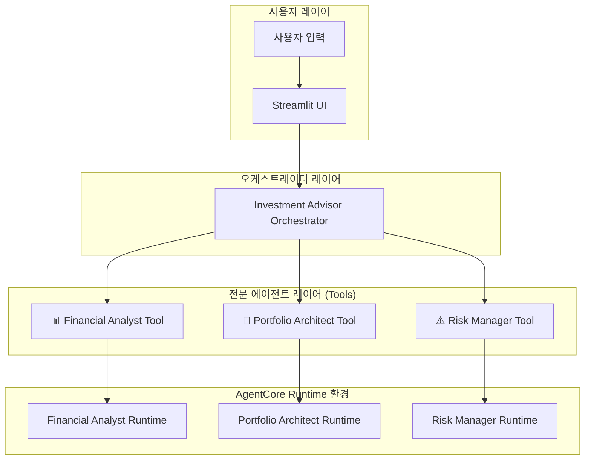
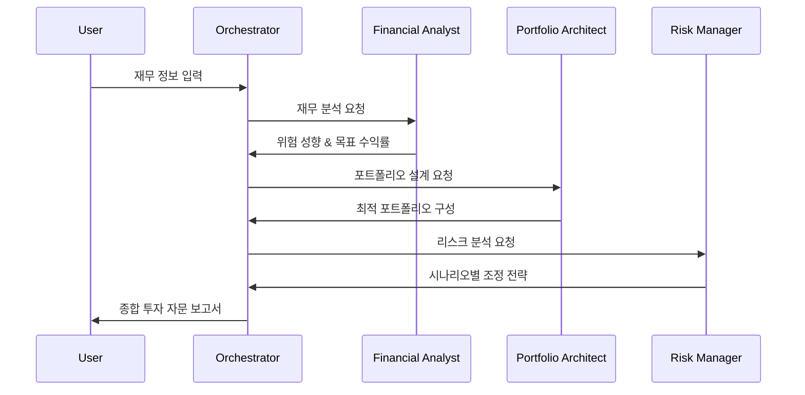

# Investment Advisor Orchestrator

**Agents as Tools 패턴**을 활용한 AI 투자 자문 오케스트레이터입니다. 전문 에이전트들을 도구로 감싸서 조율하여 사용자에게 완전한 투자 자문 서비스를 제공합니다.

## 🎯 핵심 개념

### Agents as Tools Pattern
- **오케스트레이터 에이전트**: 사용자 요청을 분석하고 적절한 전문 에이전트에게 위임
- **전문 에이전트들**: 각각의 도메인 전문성을 가진 AI 에이전트들이 도구로 활용됨
- **계층적 위임**: 매니저가 전문가들을 조율하는 인간 팀 구조를 모방

## 🏗️ 시스템 아키텍처

### 전체 시스템 구조



### 워크플로우 시퀀스



## 🤖 전문 에이전트 도구들

### 1. 📊 Financial Analyst Tool
- **패턴**: Reflection Pattern
- **역할**: 개인 재무 분석 및 위험 성향 평가
- **입력**: 사용자 재무 정보 (나이, 투자경험, 자산, 목표금액)
- **출력**: 위험 성향 평가 및 필요 연간 수익률
- **특징**: Reflection Agent를 통한 분석 결과 검증

### 2. 🤖 Portfolio Architect Tool  
- **패턴**: Tool Use Pattern
- **역할**: 실시간 데이터 기반 포트폴리오 설계
- **입력**: Financial Analyst의 분석 결과
- **출력**: 30개 ETF 중 최적 3종목 포트폴리오 구성
- **특징**: MCP Server를 통한 실시간 시장 데이터 활용

### 3. ⚠️ Risk Manager Tool
- **패턴**: Planning Pattern  
- **역할**: 뉴스 기반 리스크 분석 및 시나리오 플래닝
- **입력**: Portfolio Architect의 포트폴리오 설계 결과
- **출력**: 2개 경제 시나리오별 포트폴리오 조정 전략
- **특징**: MCP Gateway를 통한 뉴스 및 시장 지표 분석

## 🚀 배포 및 실행

### 사전 요구사항
- AWS CLI 설정 및 인증
- 전문 에이전트들이 먼저 배포되어 있어야 함:
  1. Financial Analyst
  2. Portfolio Architect  
  3. Risk Manager

### 1. 전문 에이전트들 배포 확인
```bash
# 각 전문 에이전트의 배포 상태 확인
ls ../financial_analyst/deployment_info.json
ls ../portfolio_architect/deployment_info.json  
ls ../risk_manager/deployment_info.json
```

### 2. Investment Advisor Orchestrator 배포
```bash
# 오케스트레이터 배포 (약 10분 소요)
python deploy.py
```

**배포 과정:**
1. **전문 에이전트 정보 로드**: 기존 배포된 에이전트들의 ARN 수집
2. **IAM 역할 생성**: 다른 AgentCore Runtime 호출 권한 설정
3. **설정 파일 생성**: .bedrock_agentcore.yaml, Dockerfile, requirements.txt
4. **AgentCore Runtime 배포**: 오케스트레이터를 서버리스 환경에 배포
5. **배포 정보 저장**: deployment_info.json 파일 생성

### 3. Streamlit 앱 실행
```bash
# 의존성 설치
pip install streamlit plotly pandas boto3

# 웹 애플리케이션 실행
streamlit run app.py
```

### 4. 사용법
1. 브라우저에서 `http://localhost:8501` 접속
2. 투자자 정보 입력:
   - 투자 가능 금액
   - 나이
   - 주식 투자 경험
   - 1년 후 목표 금액
   - 추가 요구사항 (선택사항)
3. "종합 투자 자문 시작" 버튼 클릭
4. 실시간으로 전문 에이전트들의 작업 과정 확인
5. 최종 종합 투자 자문 보고서 확인

## 📊 입력/출력 명세

### 입력 데이터 구조
```json
{
  "user_request": {
    "user_financial_data": {
      "total_investable_amount": 50000000,
      "age": 35,
      "stock_investment_experience_years": 10,
      "target_amount": 70000000
    },
    "additional_requirements": "ESG 투자 선호, 배당 중시"
  }
}
```

### 출력 데이터 구조 (최종 보고서)
```markdown
# 🎯 종합 투자 자문 보고서

## 📊 재무 분석 요약
- 위험 성향: 공격적
- 목표 수익률: 40.0%
- 분석 근거: 35세 젊은 나이, 10년 투자 경험...

## 🤖 추천 포트폴리오  
- 자산 배분: QQQ 50%, SPY 30%, GLD 20%
- 투자 전략: 고성장 기술주 중심의 공격적 포트폴리오
- 구성 근거: 높은 목표 수익률 달성을 위한 성장주 중심...

## ⚠️ 리스크 관리 전략
### 시나리오 1: 테크 주도 경기 회복
- 상황: 금리 인하와 함께 기술 섹터 주도 성장
- 조정 전략: QQQ 70%, SPY 25%, GLD 5%
- 근거: 기술 섹터 성장에 더 많이 노출

### 시나리오 2: 인플레이션 지속과 경기 둔화
- 상황: 고금리 지속 및 인플레이션 압력
- 조정 전략: QQQ 40%, SPY 40%, GLD 20%
- 근거: 안전자산 비중 확대로 리스크 관리

## 💡 최종 권고사항
[종합적인 투자 조언 및 주의사항]
```

## 🔧 고급 설정

### 환경변수 설정
```bash
# 전문 에이전트 ARN들 (배포 시 자동 설정)
export FINANCIAL_ANALYST_ARN="arn:aws:bedrock-agentcore:..."
export PORTFOLIO_ARCHITECT_ARN="arn:aws:bedrock-agentcore:..."
export RISK_MANAGER_ARN="arn:aws:bedrock-agentcore:..."
export AWS_REGION="us-west-2"
```

### 오케스트레이터 모델 설정
```python
# investment_advisor.py에서 수정 가능
class Config:
    MODEL_ID = "us.anthropic.claude-3-7-sonnet-20250219-v1:0"
    TEMPERATURE = 0.2  # 조율 역할에 적합한 균형잡힌 설정
    MAX_TOKENS = 4000  # 종합적인 분석을 위한 충분한 토큰
```

### 도구 선택 로직 커스터마이징
오케스트레이터의 시스템 프롬프트에서 도구 선택 기준을 수정할 수 있습니다:
- 순차적 실행 순서 변경
- 조건부 도구 호출 로직 추가
- 에러 처리 및 재시도 로직 강화

## 🔍 모니터링 및 디버깅

### 로그 확인
```bash
# 오케스트레이터 로그
aws logs tail /aws/lambda/investment-advisor-orchestrator --follow

# 전문 에이전트별 로그
aws logs tail /aws/lambda/financial-analyst-runtime --follow
aws logs tail /aws/lambda/portfolio-architect-runtime --follow
aws logs tail /aws/lambda/risk-manager-runtime --follow
```

### 성능 메트릭
- **전체 응답 시간**: 평균 60-120초 (3개 전문 에이전트 순차 실행)
- **성공률**: 95%+ (모든 전문 에이전트가 정상 동작 시)
- **비용**: 요청당 약 $0.15-0.30 (오케스트레이터 + 3개 전문 에이전트)

### 문제 해결
- **전문 에이전트 호출 실패**: ARN 설정 및 권한 확인
- **순차 실행 오류**: 이전 단계 결과 형식 검증
- **최종 보고서 생성 실패**: 모든 도구 결과 수집 상태 확인

## 🎉 주요 장점

✅ **완전한 자동화**: 사용자 입력만으로 전체 투자 자문 프로세스 자동 실행  
✅ **전문성 활용**: 각 도메인별 최적화된 전문 에이전트들의 협업  
✅ **확장 가능**: 새로운 전문 에이전트를 도구로 쉽게 추가 가능  
✅ **투명성**: 각 전문 에이전트의 작업 과정을 실시간으로 확인  
✅ **일관성**: 오케스트레이터가 모든 결과를 종합하여 일관된 자문 제공  
✅ **유지보수**: 각 전문 에이전트를 독립적으로 업데이트 가능  

## 📁 프로젝트 구조

```
investment_advisor/
├── investment_advisor.py     # 메인 오케스트레이터 클래스
├── deploy.py                # AgentCore Runtime 배포 스크립트
├── app.py                   # Streamlit 웹 애플리케이션
├── requirements.txt         # Python 의존성
├── __init__.py             # 패키지 초기화
├── .bedrock_agentcore.yaml # AgentCore 설정 (자동 생성)
├── Dockerfile              # 컨테이너 이미지 정의 (자동 생성)
└── deployment_info.json    # 배포 정보 (자동 생성)
```

## 🔗 연관 프로젝트

이 오케스트레이터는 다음 전문 에이전트들과 연동됩니다:

1. **📊 Financial Analyst** (Reflection 패턴)
   - 개인 재무 분석 및 위험 성향 평가
   - Reflection을 통한 분석 결과 검증

2. **🤖 Portfolio Architect** (Tool Use 패턴)  
   - 실시간 시장 데이터 기반 포트폴리오 설계
   - MCP Server를 통한 30개 ETF 데이터 활용

3. **⚠️ Risk Manager** (Planning 패턴)
   - 뉴스 기반 리스크 분석 및 시나리오 플래닝
   - MCP Gateway를 통한 외부 데이터 연동

**통합 워크플로우:**
- 사용자 재무 정보 → Financial Analyst → Portfolio Architect → Risk Manager → 종합 투자 자문 보고서

---

## 🌟 Agentic AI 4가지 패턴 완전 구현

이 Investment Advisor 시스템은 **Agentic AI의 4가지 핵심 패턴**을 모두 활용합니다:

1. **Reflection Pattern** (Financial Analyst): 분석 결과 검증
2. **Tool Use Pattern** (Portfolio Architect): 외부 데이터 활용  
3. **Planning Pattern** (Risk Manager): 체계적 시나리오 플래닝
4. **Multi Agent Pattern** (Investment Advisor Orchestrator): **Agents as Tools**

이를 통해 각 패턴의 장점을 극대화하면서도 서로 보완하는 완전한 **엔터프라이즈급 멀티 에이전트 시스템**을 구현했습니다!