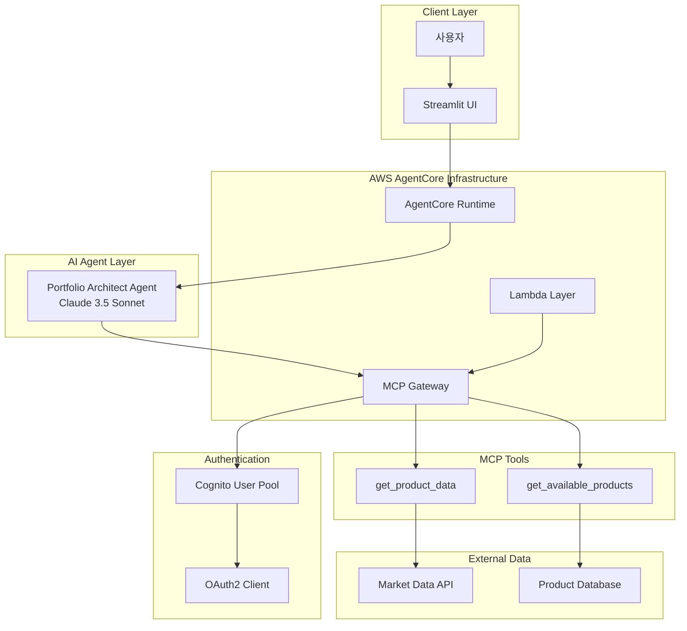
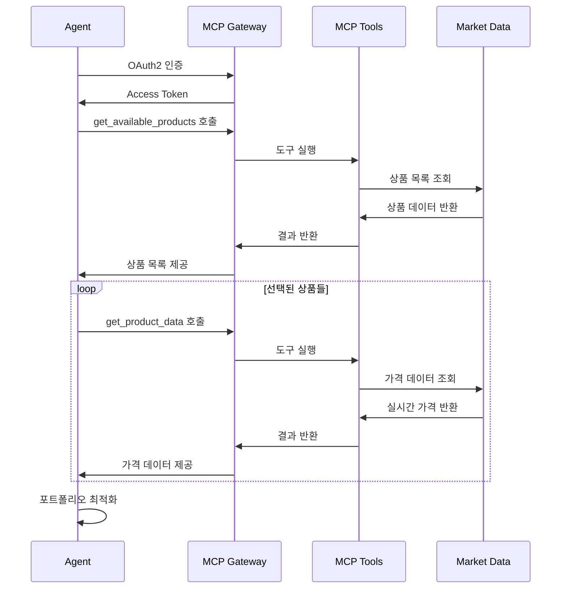
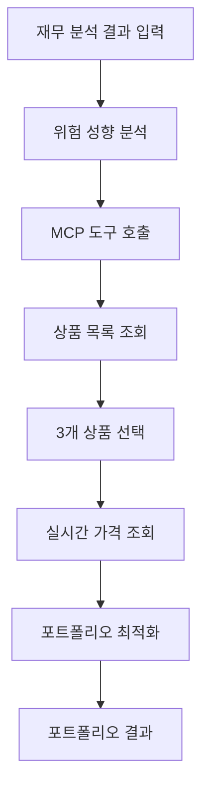

# Portfolio Architect

실시간 시장 데이터를 분석하여 맞춤형 투자 포트폴리오를 설계하는 AI 에이전트입니다. **Tool Use 패턴**을 활용하여 **MCP(Model Context Protocol)**를 통해 외부 데이터와 연동하고, **AWS Bedrock AgentCore Runtime** 기반으로 서버리스 환경에서 실행되어 데이터 기반 투자 전략을 제공합니다.

## 🎯 핵심 기능

### 맞춤형 포트폴리오 설계
- **개인화 분석**: Financial Analyst 결과를 기반으로 한 맞춤형 설계
- **위험 성향 반영**: 5단계 위험 성향에 따른 자산 배분 최적화
- **목표 수익률 고려**: 필요 수익률 달성을 위한 전략적 포트폴리오 구성

### 실시간 시장 데이터 활용
- **MCP 연동**: Model Context Protocol을 통한 외부 시스템 연결
- **실시간 가격**: 최신 시장 가격 데이터 기반 의사결정
- **다양한 자산**: ETF, 주식, 채권 등 다양한 투자 상품 지원

### 분산 투자 전략
- **3종목 분산**: 리스크 분산을 위한 최적 3종목 선택
- **비율 최적화**: 각 자산별 투자 비율 정밀 계산
- **리밸런싱**: 시장 상황에 따른 포트폴리오 조정 제안

### 투자 전략 및 근거 제시
- **전략 설명**: 포트폴리오 구성 전략의 명확한 설명
- **근거 제시**: 각 투자 결정의 논리적 근거 제공
- **리스크 분석**: 예상 리스크와 수익률 분석

## 🏗️ 아키텍처

### 전체 시스템 아키텍처



### MCP 연동 아키텍처



### Agentic AI 패턴: Tool Use Pattern



### Strands Agent 구성

#### Portfolio Architect Agent
- **역할**: 포트폴리오 설계 및 MCP 도구 활용
- **모델**: Claude 3.5 Sonnet
- **온도**: 0.3 (창의적 포트폴리오 설계를 위한 적정 수준)
- **도구**: MCP 클라이언트를 통한 외부 데이터 접근

#### MCP 도구 체인
- **도구 발견**: 런타임 시 사용 가능한 도구 자동 탐지
- **동적 호출**: 필요에 따른 도구 동적 실행
- **결과 통합**: 여러 도구 결과의 종합적 분석

### AgentCore 구성요소

#### Runtime
- **실행 환경**: AWS Lambda 기반 서버리스
- **환경변수**: MCP Gateway 연결 정보 자동 주입
- **확장성**: 동시 다중 요청 처리 가능

#### Gateway
- **프로토콜**: MCP (Model Context Protocol)
- **인증**: OAuth2 Client Credentials Flow
- **보안**: Cognito User Pool 기반 인증
- **API**: RESTful API를 통한 도구 노출

#### Lambda Layer
- **의존성**: MCP 클라이언트 라이브러리
- **재사용**: 여러 Lambda 함수에서 공유
- **버전 관리**: 의존성 버전 통합 관리

## 🚀 배포 및 실행

### 사전 요구사항
- AWS CLI 설정 및 인증
- Docker 설치 (Gateway 및 Runtime 빌드용)
- Python 3.9+ 환경
- Bedrock 모델 접근 권한
- 충분한 AWS 권한 (Lambda, API Gateway, Cognito, ECR 등)

### 1. Lambda Layer 배포 (필수 선행)
```bash
cd lambda_layer

# yfinance 등 데이터 분석 라이브러리 Layer 생성 (S3 기반 대용량 배포)
python deploy_layer.py

# Layer 정보 확인
cat layer_deployment_info.json
```

**Layer 구성요소:**
- yfinance: 실시간 ETF 가격 데이터 조회
- pandas, numpy: 데이터 분석 및 처리
- S3 기반 50MB+ 대용량 Layer 지원

### 2. Lambda 함수 배포 (필수)
```bash
cd lambda

# ETF 데이터 조회 Lambda 함수 배포
python deploy_lambda.py

# 배포 결과 확인
cat lambda_deployment_info.json
```

**Lambda 구성요소:**
- get_available_products: 30개 ETF 상품 목록 조회
- get_product_data: 실시간 가격 데이터 조회 (최근 3개월)
- yfinance Layer 자동 연결

### 3. Gateway 배포 (필수)
```bash
cd gateway

# MCP Gateway 인프라 배포 (Lambda ARN 자동 로드)
python deploy_gateway.py

# 배포 결과 확인
cat gateway_deployment_info.json
```

**Gateway 구성요소:**
- MCP 프로토콜 기반 도구 노출
- Cognito OAuth2 인증 시스템
- Lambda 함수를 AI 도구로 변환
- 실시간 ETF 데이터 API 제공

### 4. Runtime 배포
```bash
# Gateway 정보 자동 로드하여 Runtime 배포
python deploy.py

# 배포 상태 확인
cat deployment_info.json
```

**Runtime 구성요소:**
- Portfolio Architect Agent (Claude 3.5 Sonnet)
- MCP 클라이언트 통합
- 환경변수 자동 설정 (Gateway 연동 정보)

### 5. Streamlit 앱 실행
```bash
# 의존성 설치
pip install streamlit boto3 plotly pandas

# 웹 애플리케이션 실행
streamlit run app.py
```

### 6. 통합 테스트
- Financial Analyst에서 재무 분석 수행
- 분석 결과를 Portfolio Architect에 입력
- 실시간 포트폴리오 설계 과정 확인
- MCP 도구 호출 및 결과 검증 (30개 ETF 중 3개 선택)

## 📊 상세 입력/출력 명세

### 입력 데이터 구조 (Financial Analyst 결과)
```json
{
  "risk_profile": "중립적",
  "risk_profile_reason": "35세 중년층으로 10년의 투자 경험을 보유하여 적정 수준의 위험 감수 가능",
  "required_annual_return_rate": 40.0,
  "return_rate_reason": "1년 내 40% 수익률 달성을 위해 공격적 투자 전략 필요"
}
```

### MCP 도구 호출 과정
1. **get_available_products 호출**
   ```json
   {
     "SPY": "SPDR S&P 500 ETF - 미국 대형주 500개 기업",
     "QQQ": "Invesco QQQ ETF - 나스닥 100 기술주",
     "VTI": "Vanguard Total Stock Market ETF - 미국 전체 주식시장",
     "ARKK": "ARK Innovation ETF - 혁신 기술주",
     "BND": "Vanguard Total Bond Market ETF - 미국 전체 채권",
     "GLD": "SPDR Gold Shares - 금 현물 ETF"
   }
   ```
   *총 30개 ETF 상품 (주요 지수, 국제, 채권, 섹터, 혁신, 배당 카테고리)*

2. **3개 상품 선택 (AI 판단)**
   - 위험 성향과 목표 수익률 고려
   - 분산 투자 원칙 적용 (최소 3개, 최대 60% 제한)
   - 상관관계 분석 및 카테고리 분산

3. **get_product_data 동시 호출 (최근 3개월 데이터)**
   ```json
   {
     "QQQ": {
       "2024-05-01": 450.25,
       "2024-05-02": 452.10,
       "2024-05-03": 448.75,
       "...": "..."
     },
     "SPY": {
       "2024-05-01": 520.30,
       "2024-05-02": 522.15,
       "...": "..."
     }
   }
   ```

### 출력 데이터 구조
```json
{
  "portfolio_allocation": {
    "QQQ": 50,    // 나스닥 기술주 ETF - 50%
    "SPY": 30,    // S&P 500 ETF - 30%
    "VTI": 20     // 전체 주식시장 ETF - 20%
  },
  "strategy": "공격적 성장 전략: 높은 목표 수익률(40%) 달성을 위해 기술주 중심의 성장주 포트폴리오 구성. QQQ를 주축으로 하여 기술주 상승장 수혜를 극대화하고, SPY와 VTI로 안정성 보완",
  "reason": "QQQ(나스닥 기술주) 50% - 높은 성장 잠재력으로 목표 수익률 달성 기여, SPY(S&P 500) 30% - 대형주 안정성으로 리스크 완충, VTI(전체 시장) 20% - 중소형주 포함으로 추가 분산 효과"
}
```

## 🔧 고급 설정 및 커스터마이징

### 모델 및 에이전트 설정
```python
# portfolio_architect.py에서 수정 가능

class Config:
    MODEL_ID = "us.anthropic.claude-3-7-sonnet-20250219-v1:0"
    TEMPERATURE = 0.3      # 창의적 포트폴리오 설계를 위한 적정 수준
    MAX_TOKENS = 3000      # 상세한 분석을 위한 충분한 토큰
```

### Lambda 함수 ETF 상품 설정
```python
# lambda/lambda_function.py에서 수정 가능

# 지원 투자 상품 (30개 ETF)
SUPPORTED_PRODUCTS = {
    # 주요 지수 ETF (5개)
    "SPY": "SPDR S&P 500 ETF - 미국 대형주 500개 기업",
    "QQQ": "Invesco QQQ ETF - 나스닥 100 기술주",
    "VTI": "Vanguard Total Stock Market ETF - 미국 전체 주식시장",
    
    # 국제/신흥국 ETF (5개)
    "VEA": "Vanguard FTSE Developed Markets ETF - 선진국 주식",
    "VWO": "Vanguard FTSE Emerging Markets ETF - 신흥국 주식",
    
    # 채권/안전자산 ETF (5개)
    "BND": "Vanguard Total Bond Market ETF - 미국 전체 채권",
    "GLD": "SPDR Gold Shares - 금 현물 ETF",
    
    # 섹터별 ETF (8개)
    "XLK": "Technology Select Sector SPDR Fund - 기술 섹터",
    "XLF": "Financial Select Sector SPDR Fund - 금융 섹터",
    
    # 혁신/성장 ETF (5개)
    "ARKK": "ARK Innovation ETF - 혁신 기술주",
    "ARKQ": "ARK Autonomous Technology & Robotics ETF - 자율주행/로봇",
    
    # 배당 ETF (2개)
    "SCHD": "Schwab US Dividend Equity ETF - 미국 배당주",
    "VYM": "Vanguard High Dividend Yield ETF - 고배당 ETF"
}

# yfinance 데이터 조회 설정
PRICE_DATA_DAYS = 100  # 최근 100일 (약 3개월)
```

### 포트폴리오 최적화 로직
- **위험 성향별 자산 배분**:
  - 매우 보수적: 채권 70%, 주식 30%
  - 보수적: 채권 50%, 주식 50%
  - 중립적: 채권 30%, 주식 70%
  - 공격적: 채권 10%, 주식 90%
  - 매우 공격적: 주식 100%

- **분산 투자 원칙**:
  - 최소 3개 이상 종목
  - 단일 종목 최대 60% 제한
  - 상관관계 고려한 종목 선택

## 🔍 모니터링 및 운영

### 성능 메트릭
- **응답 시간**: 평균 15-30초 (MCP 호출 포함)
- **성공률**: 95%+ (정상 입력 및 네트워크 상태 기준)
- **MCP 호출 성공률**: 98%+
- **비용**: 요청당 약 $0.05-0.15 (Gateway + Runtime)

### 로그 및 모니터링
```bash
# Runtime 로그 확인
aws logs tail /aws/lambda/portfolio-architect-runtime --follow

# Gateway 로그 확인  
aws logs tail /aws/lambda/mcp-gateway --follow

# API Gateway 메트릭 확인
aws cloudwatch get-metric-statistics \
  --namespace AWS/ApiGateway \
  --metric-name Count \
  --dimensions Name=ApiName,Value=mcp-gateway
```

### 문제 해결 가이드

#### 배포 관련 문제
- **Layer 배포 실패**: yfinance.zip 파일 존재 여부, S3 권한 확인
- **Lambda 배포 실패**: Layer 선행 배포 여부, IAM 권한 확인
- **Gateway 배포 실패**: Lambda 선행 배포 여부, Cognito 권한 확인
- **Runtime 배포 실패**: Gateway 선행 배포 여부, 환경변수 설정 확인

#### 실행 시간 문제
- **MCP 연결 실패**: Gateway URL, OAuth2 토큰 확인
- **도구 호출 오류**: Lambda 함수 상태, yfinance 네트워크 연결 확인
- **ETF 데이터 조회 실패**: 티커 심볼 유효성, 시장 개장 시간 확인
- **포트폴리오 생성 실패**: 입력 데이터 형식, 모델 응답 확인

#### 성능 최적화
- **응답 시간 개선**: 병렬 도구 호출, 캐싱 활용
- **비용 최적화**: 불필요한 도구 호출 최소화
- **안정성 향상**: 재시도 로직, 오류 처리 강화

## 📁 상세 프로젝트 구조

```
portfolio_architect/
├── lambda_layer/              # Lambda Layer 구성요소 (yfinance 등)
│   ├── deploy_layer.py       # Layer 배포 스크립트 (S3 기반 대용량 지원)
│   ├── yfinance.zip         # yfinance, pandas, numpy 라이브러리 패키지
│   └── layer_deployment_info.json    # Layer 배포 정보
├── lambda/                   # Lambda 함수 구성요소 (ETF 데이터 조회)
│   ├── deploy_lambda.py     # Lambda 배포 스크립트
│   ├── lambda_function.py   # ETF 데이터 조회 함수 (30개 상품 지원)
│   └── lambda_deployment_info.json  # Lambda 배포 정보
├── gateway/                  # MCP Gateway 구성요소 (도구 노출)
│   ├── deploy_gateway.py    # Gateway 배포 스크립트 (Lambda ARN 자동 로드)
│   ├── target_config.py     # MCP 도구 스키마 정의
│   ├── utils.py            # IAM, Cognito 관리 유틸리티
│   └── gateway_deployment_info.json  # Gateway 배포 정보
├── portfolio_architect.py   # 메인 에이전트 클래스 (MCP 클라이언트 통합)
├── deploy.py               # Runtime 배포 스크립트 (Gateway 정보 자동 로드)
├── app.py                  # Streamlit 웹 애플리케이션 (차트 시각화 포함)
├── requirements.txt        # Runtime 의존성 (strands, mcp-client 등)
├── __init__.py            # 패키지 초기화
├── .bedrock_agentcore.yaml # AgentCore 설정
├── Dockerfile             # Runtime 컨테이너
└── deployment_info.json   # Runtime 배포 정보
```

## 🔗 연관 프로젝트

이 프로젝트는 **Financial Analyst**와 연동하여 완전한 투자 자문 시스템을 구성합니다:

1. **Financial Analyst** (Reflection 패턴) → 개인 재무 분석 및 위험 성향 평가
2. **Portfolio Architect** (Tool Use 패턴) → 실시간 데이터 기반 포트폴리오 설계

**통합 워크플로우:**
- Financial Analyst에서 JSON 형태의 재무 분석 결과 생성
- Portfolio Architect가 해당 결과를 입력받아 MCP 도구 활용
- 30개 ETF 중 최적 3개 선택하여 포트폴리오 구성
- 실시간 가격 데이터 기반 투자 비율 최적화