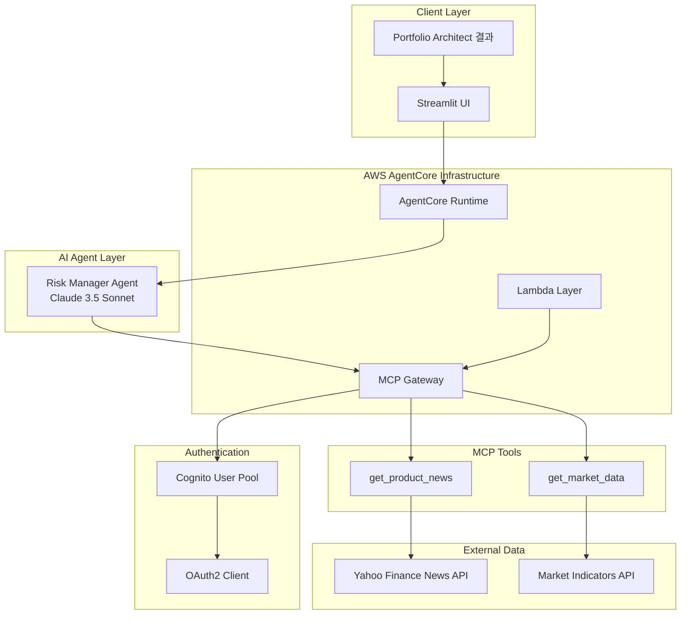
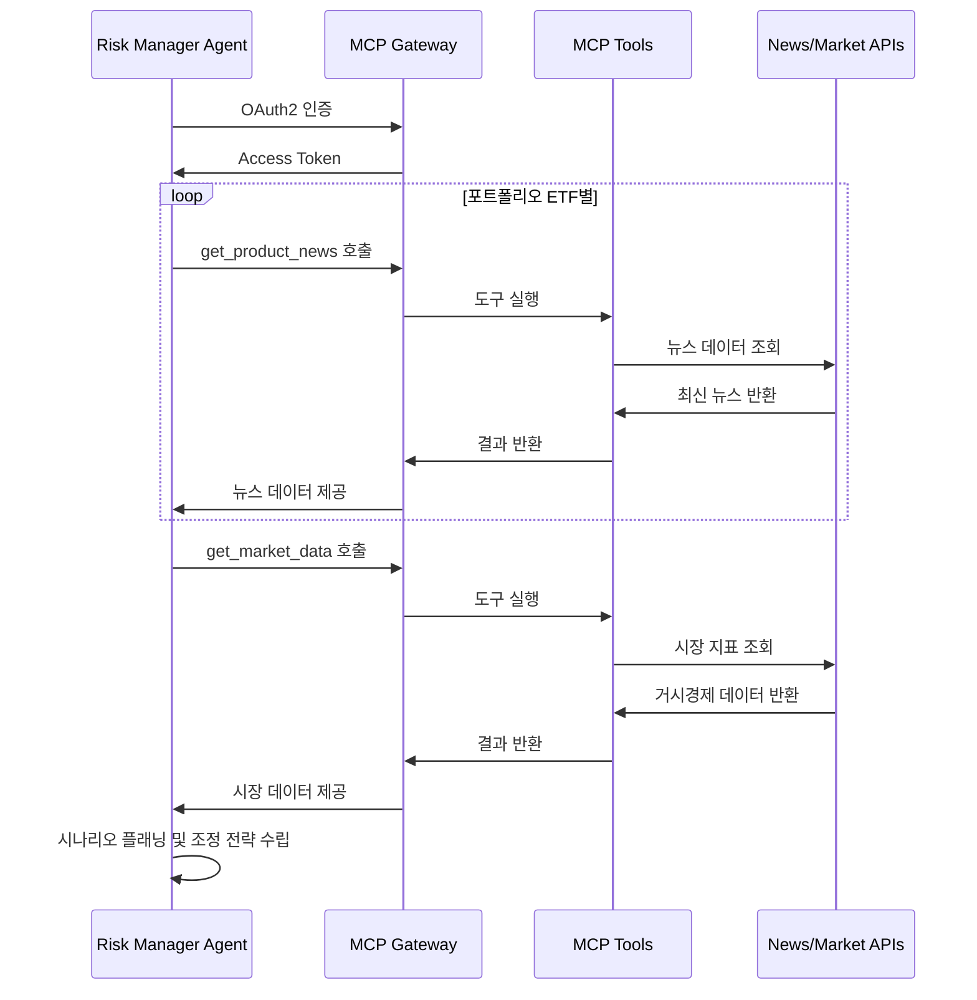
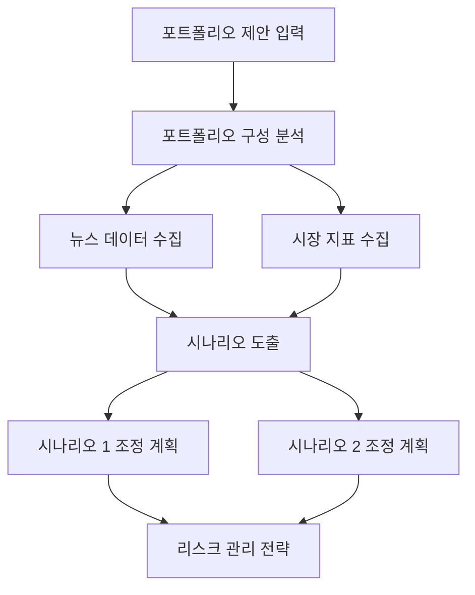

# Risk Manager

포트폴리오 제안을 바탕으로 뉴스 기반 리스크 분석을 수행하고, 경제 시나리오에 따른 포트폴리오 조정 가이드를 제공하는 AI 에이전트입니다. **Planning 패턴**을 활용하여 **MCP(Model Context Protocol)**를 통해 외부 데이터와 연동하고, **AWS Bedrock AgentCore Runtime** 기반으로 서버리스 환경에서 실행되어 데이터 기반 리스크 관리 전략을 제공합니다.

## 🎯 핵심 기능

### 뉴스 기반 리스크 분석
- **실시간 뉴스 수집**: Portfolio Architect 결과의 각 ETF별 최신 뉴스 분석
- **리스크 요인 식별**: 뉴스 데이터를 통한 잠재적 위험 요소 탐지
- **시장 센티먼트 분석**: 뉴스 톤앤매너 기반 시장 심리 평가

### 경제 시나리오 플래닝
- **2개 핵심 시나리오**: 발생 가능성이 높은 경제 상황 도출
- **시나리오별 영향 분석**: 각 시나리오가 포트폴리오에 미치는 영향 평가
- **동적 조정 전략**: 시나리오별 최적 자산 배분 재조정 방안

### 시장 지표 통합 분석
- **거시경제 지표**: 달러 지수, 국채 수익률, VIX 등 주요 지표 모니터링
- **상관관계 분석**: 시장 지표와 포트폴리오 자산 간 연관성 분석
- **조기 경보 시스템**: 리스크 신호 조기 탐지 및 알림

### 포트폴리오 조정 가이드
- **기존 자산 유지**: 새로운 자산 추가 없이 기존 ETF 비율만 조정
- **리스크 최적화**: 각 시나리오별 리스크 대비 수익률 최적화
- **실행 가능한 전략**: 구체적이고 실행 가능한 조정 방안 제시

## 🏗️ 아키텍처

### 전체 시스템 아키텍처



### MCP 연동 아키텍처



### Agentic AI 패턴: Planning Pattern



### Strands Agent 구성

#### Risk Manager Agent
- **역할**: 리스크 분석 및 시나리오 플래닝
- **모델**: Claude 3.5 Sonnet
- **온도**: 0.2 (분석적 사고와 창의적 시나리오 도출의 균형)
- **도구**: MCP 클라이언트를 통한 뉴스 및 시장 데이터 접근

#### MCP 도구 체인
- **뉴스 분석**: ETF별 최신 뉴스 수집 및 분석
- **시장 지표**: 거시경제 지표 실시간 모니터링
- **동적 조정**: 시나리오별 포트폴리오 재배분 계획

### AgentCore 구성요소

#### Runtime
- **실행 환경**: AWS Lambda 기반 서버리스
- **환경변수**: MCP Gateway 연결 정보 자동 주입
- **확장성**: 동시 다중 요청 처리 가능

#### Gateway
- **프로토콜**: MCP (Model Context Protocol)
- **인증**: OAuth2 Client Credentials Flow
- **보안**: Cognito User Pool 기반 인증
- **API**: RESTful API를 통한 도구 노출

#### Lambda Layer
- **의존성**: yfinance 라이브러리 (뉴스 및 시장 데이터 조회)
- **재사용**: Portfolio Architect와 동일한 Layer 공유
- **버전 관리**: 의존성 버전 통합 관리

## 🚀 배포 및 실행

### 사전 요구사항
- AWS CLI 설정 및 인증
- Docker 설치 (Gateway 및 Runtime 빌드용)
- Python 3.9+ 환경
- Bedrock 모델 접근 권한
- Portfolio Architect Layer 선행 배포 (yfinance 공유)

### 1. Lambda Layer 배포 (필수 선행)
```bash
cd lambda_layer

# yfinance 등 데이터 분석 라이브러리 Layer 생성 (Portfolio Architect Layer 재사용 우선)
python deploy_lambda_layer.py

# Layer 정보 확인
cat layer_deployment_info.json
```

**Layer 구성요소:**
- yfinance: 실시간 뉴스 및 시장 데이터 조회
- pandas, numpy: 데이터 분석 및 처리
- Portfolio Architect Layer 재사용 우선 (비용 최적화)

### 2. Lambda 함수 배포 (필수)
```bash
cd lambda

# 리스크 분석 Lambda 함수 배포
python deploy_lambda.py

# 배포 결과 확인
cat lambda_deployment_info.json
```

**Lambda 구성요소:**
- get_product_news: ETF별 최신 뉴스 조회 (상위 5개)
- get_market_data: 주요 거시경제 지표 조회 (달러지수, 국채수익률, VIX, 원유)
- Portfolio Architect Layer 재사용 (yfinance)

### 3. Gateway 배포 (필수)
```bash
cd gateway

# MCP Gateway 인프라 배포 (Lambda ARN 자동 로드)
python deploy_gateway.py

# 배포 결과 확인
cat gateway_deployment_info.json
```

**Gateway 구성요소:**
- MCP 프로토콜 기반 도구 노출
- Cognito OAuth2 인증 시스템
- Lambda 함수를 AI 도구로 변환
- 실시간 뉴스 및 시장 데이터 API 제공

### 4. Runtime 배포
```bash
# Gateway 정보 자동 로드하여 Runtime 배포
python deploy.py

# 배포 상태 확인
cat deployment_info.json
```

**Runtime 구성요소:**
- Risk Manager Agent (Claude 3.5 Sonnet)
- MCP 클라이언트 통합
- 환경변수 자동 설정 (Gateway 연동 정보)

### 5. Streamlit 앱 실행
```bash
# 의존성 설치
pip install streamlit boto3 plotly pandas

# 웹 애플리케이션 실행
streamlit run app.py
```

### 6. 통합 테스트
- Portfolio Architect에서 포트폴리오 설계 수행
- 설계 결과를 Risk Manager에 입력
- 실시간 뉴스 및 시장 데이터 수집 과정 확인
- 2개 시나리오별 조정 전략 검증

## 📊 상세 입력/출력 명세

### 입력 데이터 구조 (Portfolio Architect 결과)
```json
{
  "portfolio_allocation": {
    "QQQ": 60,
    "SPY": 30,
    "GLD": 10
  },
  "strategy": "고성장 기술주 중심의 공격적 포트폴리오로, 시장 전반의 익스포저와 위험 헤지를 결합한 전략",
  "reason": "고객의 공격적인 위험 성향과 40%의 높은 목표 수익률을 달성하기 위해..."
}
```

### MCP 도구 호출 과정
1. **get_product_news 호출** (각 ETF별)
   ```json
   {
     "ticker": "QQQ",
     "news": [
       {
         "title": "Nasdaq 100 ETF Sees Strong Inflows Amid Tech Rally",
         "summary": "Technology sector momentum continues...",
         "publish_date": "2024-08-20"
       }
     ]
   }
   ```

2. **get_market_data 호출**
   ```json
   {
     "us_dollar_index": {
       "description": "미국 달러 강세를 나타내는 지수",
       "value": 103.45
     },
     "us_10y_treasury_yield": {
       "description": "미국 10년 국채 수익률 (%)",
       "value": 4.25
     },
     "vix_volatility_index": {
       "description": "시장의 변동성을 나타내는 VIX 지수",
       "value": 18.75
     }
   }
   ```

### 출력 데이터 구조
```json
{
  "scenario1": {
    "name": "테크 주도 경기 회복",
    "description": "금리 인하와 함께 기술 섹터가 주도하는 경기 회복이 이루어지는 시나리오입니다...",
    "allocation_management": {
      "QQQ": 70,
      "SPY": 25,
      "GLD": 5
    },
    "reason": "QQQ의 비중을 70%로 늘려 기술 섹터의 성장에 더 많이 노출시킵니다..."
  },
  "scenario2": {
    "name": "인플레이션 지속과 경기 둔화",
    "description": "고금리가 지속되고 인플레이션 압력이 계속되는 가운데...",
    "allocation_management": {
      "QQQ": 40,
      "SPY": 40,
      "GLD": 20
    },
    "reason": "QQQ의 비중을 40%로 줄이고 SPY를 40%로 늘려..."
  }
}
```

## 🔧 고급 설정 및 커스터마이징

### 모델 및 에이전트 설정
```python
# risk_manager.py에서 수정 가능

class Config:
    MODEL_ID = "us.anthropic.claude-3-7-sonnet-20250219-v1:0"
    TEMPERATURE = 0.2      # 분석적 사고와 창의적 시나리오의 균형
    MAX_TOKENS = 4000      # 상세한 시나리오 분석을 위한 충분한 토큰
```

### Lambda 함수 뉴스 및 시장 데이터 설정
```python
# lambda/lambda_function.py에서 수정 가능

# 뉴스 조회 설정
NEWS_TOP_N = 5  # ETF별 상위 5개 뉴스

# 시장 지표 설정
MARKET_INDICATORS = {
    "us_dollar_index": {"ticker": "DX-Y.NYB", "description": "미국 달러 강세 지수"},
    "us_10y_treasury_yield": {"ticker": "^TNX", "description": "미국 10년 국채 수익률"},
    "us_2y_treasury_yield": {"ticker": "2YY=F", "description": "미국 2년 국채 수익률"},
    "vix_volatility_index": {"ticker": "^VIX", "description": "VIX 변동성 지수"},
    "crude_oil_price": {"ticker": "CL=F", "description": "WTI 원유 선물 가격"}
}
```

### 시나리오 플래닝 로직
- **시나리오 도출**: 뉴스 분석 + 시장 지표 기반 2개 핵심 시나리오
- **조정 전략**: 기존 ETF 비율만 조정 (새로운 자산 추가 금지)
- **리스크 관리**: 각 시나리오별 리스크 대비 수익률 최적화

## 🔍 모니터링 및 운영

### 성능 메트릭
- **응답 시간**: 평균 20-40초 (뉴스 수집 + 시장 데이터 + 시나리오 분석)
- **성공률**: 95%+ (정상 입력 및 네트워크 상태 기준)
- **MCP 호출 성공률**: 98%+
- **비용**: 요청당 약 $0.08-0.20 (Gateway + Runtime + 다중 도구 호출)

### 로그 및 모니터링
```bash
# Runtime 로그 확인
aws logs tail /aws/lambda/risk-manager-runtime --follow

# Gateway 로그 확인  
aws logs tail /aws/lambda/mcp-gateway-risk-manager --follow

# API Gateway 메트릭 확인
aws cloudwatch get-metric-statistics \
  --namespace AWS/ApiGateway \
  --metric-name Count \
  --dimensions Name=ApiName,Value=mcp-gateway-risk-manager
```

### 문제 해결 가이드

#### 배포 관련 문제
- **Lambda 배포 실패**: Portfolio Architect Layer 선행 배포 여부 확인
- **Gateway 배포 실패**: Lambda 선행 배포 여부, Cognito 권한 확인
- **Runtime 배포 실패**: Gateway 선행 배포 여부, 환경변수 설정 확인

#### 실행 시간 문제
- **MCP 연결 실패**: Gateway URL, OAuth2 토큰 확인
- **뉴스 조회 실패**: yfinance 네트워크 연결, ETF 티커 유효성 확인
- **시장 데이터 조회 실패**: 시장 개장 시간, 지표 티커 유효성 확인
- **시나리오 생성 실패**: 입력 데이터 형식, 모델 응답 확인

#### 성능 최적화
- **응답 시간 개선**: 병렬 도구 호출, 캐싱 활용
- **비용 최적화**: 불필요한 뉴스 조회 최소화
- **안정성 향상**: 재시도 로직, 오류 처리 강화

## 📁 상세 프로젝트 구조

```
risk_manager/
├── lambda_layer/             # Lambda Layer 구성요소 (yfinance 등)
│   ├── deploy_lambda_layer.py # Layer 배포 스크립트 (Portfolio Architect 재사용 우선)
│   ├── yfinance.zip         # yfinance, pandas, numpy 라이브러리 패키지
│   └── layer_deployment_info.json    # Layer 배포 정보
├── lambda/                   # Lambda 함수 구성요소 (뉴스 및 시장 데이터 조회)
│   ├── deploy_lambda.py     # Lambda 배포 스크립트
│   ├── lambda_function.py   # 뉴스 및 시장 데이터 조회 함수
│   └── lambda_deployment_info.json  # Lambda 배포 정보
├── gateway/                  # MCP Gateway 구성요소 (도구 노출)
│   ├── deploy_gateway.py    # Gateway 배포 스크립트 (Lambda ARN 자동 로드)
│   ├── target_config.py     # MCP 도구 스키마 정의
│   ├── utils.py            # IAM, Cognito 관리 유틸리티
│   └── gateway_deployment_info.json  # Gateway 배포 정보
├── risk_manager.py         # 메인 에이전트 클래스 (MCP 클라이언트 통합)
├── deploy.py               # Runtime 배포 스크립트 (Gateway 정보 자동 로드)
├── app.py                  # Streamlit 웹 애플리케이션 (시나리오 시각화 포함)
├── requirements.txt        # Runtime 의존성 (strands, mcp-client 등)
├── __init__.py            # 패키지 초기화
├── .bedrock_agentcore.yaml # AgentCore 설정
├── Dockerfile             # Runtime 컨테이너
└── deployment_info.json   # Runtime 배포 정보
```

## 🔗 연관 프로젝트

이 프로젝트는 **Portfolio Architect**와 연동하여 완전한 투자 자문 시스템을 구성합니다:

1. **Financial Analyst** (Reflection 패턴) → 개인 재무 분석 및 위험 성향 평가
2. **Portfolio Architect** (Tool Use 패턴) → 실시간 데이터 기반 포트폴리오 설계
3. **Risk Manager** (Planning 패턴) → 뉴스 기반 리스크 분석 및 시나리오 플래닝

**통합 워크플로우:**
- Financial Analyst에서 JSON 형태의 재무 분석 결과 생성
- Portfolio Architect가 해당 결과를 입력받아 MCP 도구 활용하여 포트폴리오 구성
- Risk Manager가 포트폴리오 결과를 입력받아 뉴스 및 시장 데이터 분석
- 2개 경제 시나리오별 포트폴리오 조정 전략 제시
- 실시간 리스크 모니터링 및 동적 조정 가이드 제공